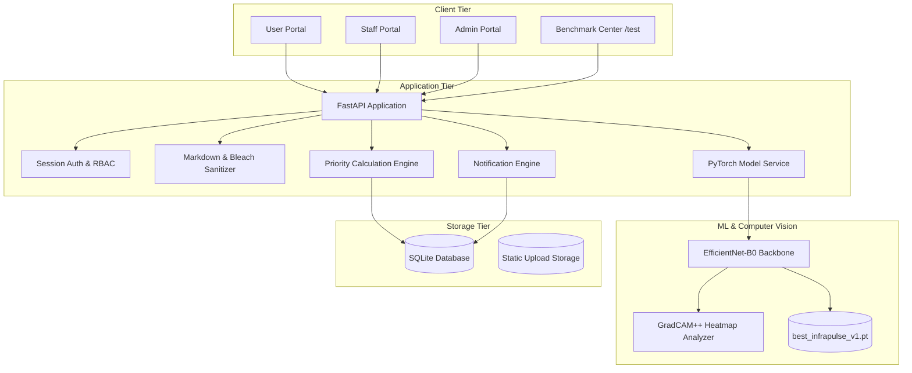

# InfraPulse - Infrastructure Defect Detection and Priority Maintenance System

InfraPulse is an automated infrastructure defect triage and maintenance prioritization system. It processes photographic defect evidence through deep learning vision models, categorizes reports into department queues (Structural, Functional, Performance), computes dynamic priority scores using GradCAM++ localization metrics, and manages ticket status progression across user, staff, and admin portals.

---

## Core Problem Statement Features

The platform implements all required defect intake, triage, ranking, and dispatch workflows:

1. **Defect Photo Intake & Triage**:
   - Web portal for users to report infrastructure issues with photographs, location details, and descriptions.
   - Categorization into three designated operational departments:
     - **Structural**: Heavy structural hazards (e.g., Concrete Spalling).
     - **Functional**: Service disruptions and health/safety hazards (e.g., Stagnant Water / Flooding).
     - **Performance**: Aesthetic and surface degradations (e.g., Cracked Floor Tiles, Paint Peeling).

2. **Objective Priority Scoring Engine**:
   - Mathematically orders queues to prevent manual triage bottlenecks:
     $$\text{Priority Score} = \left( \text{Severity} \times 0.6 + \left(\frac{\text{Extent}}{100}\right) \times 4.0 + B_{\text{defect}} \right) \times W_{\text{cat}}$$
   - **Category Weights ($W_{\text{cat}}$)**: Structural = 1.5, Functional = 1.2, Performance = 1.0.
   - **Defect Boosts ($B_{\text{defect}}$)**: Spalling (+2.0), Stagnant Water (+1.5), Cracked Tiles (+1.2), Paint Peeling (+1.0).

3. **Status Lifecycle & Queue Dispatch**:
   - Tickets transition through `Submitted` $\to$ `Assigned` $\to$ `In Progress` $\to$ `Resolved`.
   - Resolved tickets are automatically removed from the active prioritization queue.

4. **Multi-Role Portals**:
   - **User Portal**: Report defects, track submission status, live queue standing, and post discussion comments.
   - **Staff Operations Console**: Filter queues by department, claim tickets, update progress, and export records.
   - **Administrator Portal**: System-wide oversight, staff account provisioning, and record management.

---

## Extra Features and Quality of Life (QoL) Enhancements

Beyond the baseline specifications, InfraPulse incorporates the following production-grade capabilities:

1. **Deep Learning Vision Architecture (EfficientNet-B0 + GradCAM++)**:
   - Custom PyTorch vision pipeline (`app/model/`) trained on building defect datasets.
   - Uses **GradCAM++** attention heatmaps and Canny edge density to compute real **Severity (0–100%)** and **Extent (0–100%)** from visual pixels rather than mock heuristics.
   - Includes graceful heuristic fallback if deep learning libraries are not installed.

2. **Live Interactive Model Benchmark (`/test`)**:
   - A dedicated evaluation center comparing the PyTorch Deep Learning Model against baseline heuristics on holdout test datasets.
   - Memory-safe pagination (10 images/page) and in-memory prediction caching to ensure low CPU/RAM overhead.

3. **WYSIWYG Markdown Editor & Safe HTML Rendering**:
   - Interactive formatting toolbar (Bold, Italic, Headers, Lists, Code, Quotes, Tables) with live "Write / Preview" tabs on ticket submission.
   - Server-side sanitized markdown rendering (`bleach` + `markdown`) on ticket detail and dashboard views.

4. **Real-Time Ticket Discussion & Audio Feedback**:
   - In-app communication feed on ticket detail pages with background polling.
   - Web Audio API acoustic pop chime triggered when new updates or comments arrive.

5. **In-App Notification Center**:
   - Global navbar notification bell with unread badge counter and polling for ticket assignments and status updates.

6. **Departmental Role-Based Access Control (RBAC)**:
   - Staff operators are restricted to claiming and modifying tickets within their assigned department domain (`HTTP 403 Forbidden` enforced on cross-department modifications).

7. **Contact Privacy Masking**:
   - Masks sensitive user contact information (phone number, email) on public ticket views; only authorized viewers (ticket creator, staff, admin) see personal details.

8. **Enterprise CSV Queue Export**:
   - Dedicated export endpoint allowing staff and administrators to download full queue datasets in `.csv` format.

9. **Cloudflare-Inspired High-Comfort UI**:
   - Eye-friendly neutral palette (`#f8fafc` soft light background / `#0b0f19` dark mode) with Cloudflare orange accents and crisp typography (Inter font stack).

10. **100% Offline / Self-Hosted Assets**:
    - Self-contained Tailwind JS, FontAwesome SVG/webfonts, and CSS in `app/static/vendor/` with zero external CDN dependencies.

11. **Production Docker Containerization**:
    - Multi-stage `Dockerfile` and `docker-compose.yml` with automated database seeding and persistent volume mounting.

---

## Architecture Diagram



---

## Setup and Execution

### Using Docker Compose

```bash
docker compose up --build -d
```
The application will be accessible at `http://localhost:8000`.

### Local Environment Setup

```bash
# 1. Create and activate virtual environment
python3 -m venv .venv
source .venv/bin/activate

# 2. Install dependencies
pip install -r requirements.txt

# 3. Initialize database with default seed accounts
python reset_db.py

# 4. Start the application
PYTHONPATH=. uvicorn app.main:app --host 0.0.0.0 --port 8000 --reload
```

---

## Default Accounts

| Portal | Email | Password | Role / Department |
| :--- | :--- | :--- | :--- |
| **User Portal** | `user@infrapulse.org` | `user123` | Registered User |
| **Structural Staff** | `structural@infrapulse.org` | `staff123` | Structural Department |
| **Functional Staff** | `functional@infrapulse.org` | `staff123` | Functional Department |
| **Performance Staff** | `performance@infrapulse.org` | `staff123` | Performance Department |
| **Admin Portal** | `admin@infrapulse.org` | `admin123` | Administrator |

---

## Machine Learning Integration Endpoint

External classification scripts or pipelines can submit defect metrics via the REST API:

```http
POST /api/v1/complaints/{complaint_id}/classify
Content-Type: application/json

{
  "defect_name": "Spalling",
  "category": "Structural",
  "severity": 8.5,
  "extent": 45.0
}
```

---

## Automated Tests

Run the complete test suite using pytest:

```bash
PYTHONPATH=. .venv/bin/pytest -v
```

---

## Project Structure

```text
InfraPulse/
├── Dockerfile                  # Multi-stage production container definition
├── docker-compose.yml          # Container composition & volume mounting
├── schema.sql                  # Database DDL schema and indexes
├── reset_db.py                 # Database initialization and seeding script
├── requirements.txt            # Python dependencies
├── app/
│   ├── main.py                 # FastAPI app factory, Jinja2 markdown filters, and static mounts
│   ├── config.py               # Priority weights and directory configuration
│   ├── database.py             # SQLAlchemy async engine and session handling
│   ├── models.py               # ORM database models
│   ├── model_service.py        # PyTorch model singleton and caching service
│   ├── priority_queue.py       # Priority scoring algorithms and queue filtering
│   ├── auth.py                 # Password hashing and session auth helpers
│   ├── model/                  # Deep learning vision model package
│   │   ├── README.md           # Model documentation & architecture
│   │   ├── requirements.txt    # ML dependencies (torch, torchvision, grad-cam)
│   │   ├── pull_bd3_dataset.py # On-demand dataset downloader script
│   │   ├── checkpoints/        # Serialized PyTorch model weights (.pt)
│   │   └── src/                # Model, dataset loader, GradCAM++, and trainer
│   ├── routers/
│   │   ├── user.py             # Ticket submission with Markdown & detail views
│   │   ├── staff.py            # Staff queue management and CSV export
│   │   ├── admin.py            # Admin staff and ticket governance
│   │   ├── api.py              # REST endpoints for comments, notifs, and ML
│   │   ├── live.py             # Live polling endpoints
│   │   └── test_bench.py       # /test benchmark controller
│   ├── static/
│   │   ├── css/                # Enterprise & Cloudflare-inspired stylesheets
│   │   ├── vendor/             # Locally hosted Tailwind, FontAwesome & Webfonts
│   │   └── uploads/            # Uploaded defect images
│   └── templates/              # Jinja2 HTML templates with WYSIWYG editor
├── docs/
│   ├── DESIGN_DOCUMENT.md      # High-Level & Low-Level Design Document
│   └── DOCUMENTATION_REPORT.md # Technical documentation report
└── tests/
    └── test_app.py             # Automated unit & integration test suite
```
