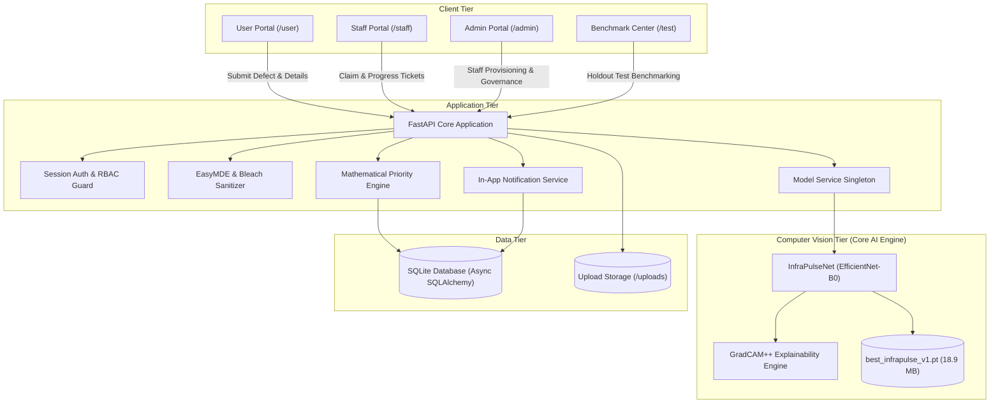
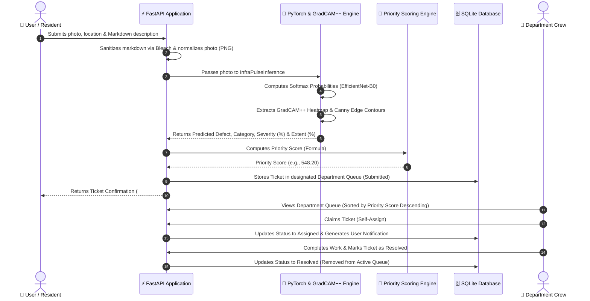
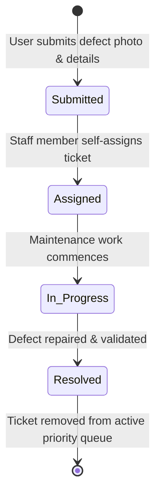
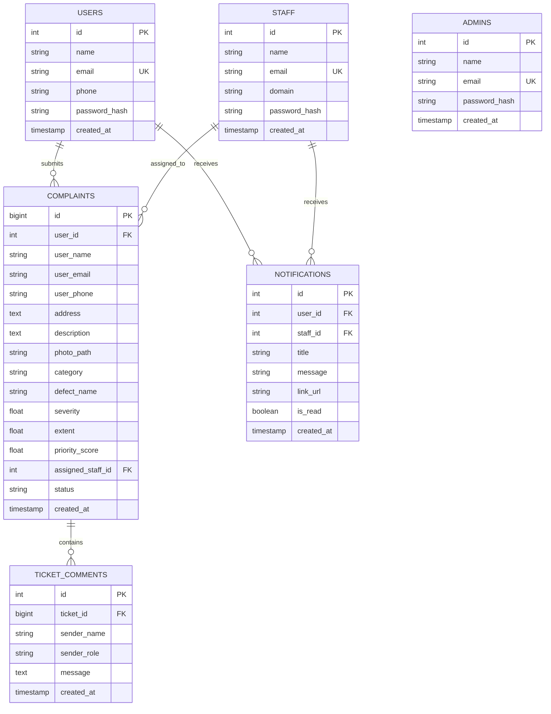

# InfraPulse - Infrastructure Defect Detection and Priority Maintenance System

InfraPulse is an automated infrastructure defect triage and maintenance prioritization system. It processes photographic defect evidence through deep learning vision models, categorizes reports into department queues (Structural, Functional, Performance), computes dynamic priority scores using GradCAM++ localization metrics, and manages ticket status progression across user, staff, and admin portals.

---

## 1. System Architecture & Workflows

### 1.1 High-Level Architecture



---

### 1.2 End-to-End Defect Ingestion & Dispatch Flow



---

### 1.3 Ticket Lifecycle State Machine



---

### 1.4 Database Entity-Relationship Diagram (ERD)



---

### 1.5 Defect Category & Queue Routing Hierarchy


---

## 2. Problem Statement Requirements (Core Deliverables)

The platform fully implements the end-to-end defect detection, triage, scoring, and dispatch workflows specified in the Problem Statement:

1. **Deep Learning Vision-Based Defect Classification**:
   - **PyTorch Neural Network (`InfraPulseNet`)**: Built on an EfficientNet-B0 backbone fine-tuned for multi-class infrastructure defect detection.
   - **Supported Defect Types**:
     - **Spalling** (Concrete damage / exposed rebar) $\to$ Routed to **Structural Department**
     - **Stagnant Water** (Puddles / drainage overflow) $\to$ Routed to **Functional Department**
     - **Cracked Tiles** (Floor fractures) $\to$ Routed to **Performance Department**
     - **Paint Peeling** (Wall surface flaking) $\to$ Routed to **Performance Department**
   - **Holdout Evaluation Performance**: Achieved **88.8% accuracy** and **0.89 weighted F1-score** across 241 holdout test images.

2. **Computer Vision Damage Localization (Severity & Extent Calculation)**:
   - **GradCAM++ Visual Explainability**: Computes class activation heatmaps from layer `backbone.features[-1]` to locate defect regions on the image pixels.
   - **Dynamic Severity Calculation**: Computed directly from peak/mean heatmap activation and Canny edge contour density.
   - **Dynamic Extent Calculation**: Computed directly from active damage coverage area and spatial fragmentation.

3. **Objective Priority Scoring Engine**:
   - Mathematically orders queues to eliminate human bias and manual triage bottlenecks:
     $$\text{Priority Score} = \left( \text{Severity} \times 0.6 + \left(\frac{\text{Extent}}{100}\right) \times 4.0 + B_{\text{defect}} \right) \times W_{\text{cat}}$$
   - **Category Weights ($W_{\text{cat}}$)**: Structural = `1.5`, Functional = `1.2`, Performance = `1.0`.
   - **Defect Boosts ($B_{\text{defect}}$)**: Spalling = `+2.0`, Stagnant Water = `+1.5`, Cracked Tiles = `+1.2`, Paint Peeling = `+1.0`.

4. **Lifecycle State Machine & Queue Dispatch**:
   - Sequential ticket status progression: `Submitted` $\to$ `Assigned` $\to$ `In Progress` $\to$ `Resolved`.
   - Automatic removal of resolved tickets from the active prioritization queue.

5. **Multi-Role Portals**:
   - **User Portal**: Report defects, track submission status, live queue standing, and post comments.
   - **Staff Operations Console**: Filter queues by department, claim tickets, update progress, and export records.
   - **Administrator Portal**: System-wide oversight, staff account provisioning, and record governance.

---

## 3. Extra Features & Quality of Life (QoL) Enhancements

Beyond the baseline specifications, InfraPulse incorporates the following 14 production-grade capabilities:

### 🧪 Live Evaluation & Benchmarking
1. **Interactive Model Benchmark Center (`/test`)**:
   - Dedicated web GUI allowing evaluators to run side-by-side comparisons between the PyTorch ML Model and the baseline classifier across 1,500+ holdout dataset images.
   - Ground truth verification with visual `✓ Correct` / `✗ Mismatch` status chips.
   - Memory-safe batch pagination (10 images/page) and in-memory prediction caching to prevent CPU/RAM throttling.
   - Split filtering (`test`, `val`, `train`) and defect category filters.

### ✍️ Rich Text & Markdown Support
2. **Embedded EasyMDE WYSIWYG Markdown Editor**:
   - Client-side EasyMDE toolbar on ticket submission supporting **Bold**, *Italic*, **H3 Headers**, **Blockquotes**, **Lists**, **Code blocks**, and **Tables**.
   - Built-in **Side-by-Side Live Preview** and **Full-screen mode** with auto-syncing form inputs.
3. **Server-Side Safe Markdown Sanitization Pipeline**:
   - Server-side Python `markdown` engine with `bleach` HTML tag sanitization to render rich typography while guaranteeing protection against XSS attacks.

### 💬 Real-Time Collaboration & Alerts
4. **Real-Time Live Discussion Feed & Sound Chime**:
   - Chronological communication timeline on ticket detail pages between residents and assigned staff.
   - Live asynchronous polling with Web Audio API acoustic pop sound indicator when new comments arrive.
5. **Centralized In-App Notification Center**:
   - Global navbar notification bell with dynamic unread counter badge.
   - Real-time polling alerting users and staff on ticket assignments and status changes with direct deep-links.

### 🔒 Security, Governance & Privacy
6. **Departmental RBAC & Cross-Domain Jurisdiction Enforcement**:
   - Staff accounts are strictly bound to their department domain (`Structural`, `Functional`, `Performance`).
   - Server enforces `HTTP 403 Forbidden` checks preventing staff from claiming or modifying tickets outside their jurisdiction.
7. **Privacy-Preserving Contact Information Masking**:
   - User phone numbers and emails are automatically masked (e.g., `+91 ••••• •••10` and `u•••••@example.com`) on public ticket views.
   - Full unmasked contact data is visible only to the ticket owner, assigned staff, and system administrators.
8. **Enterprise CSV Queue Export**:
   - Dedicated `/staff/export/csv` endpoint allowing operators to export filtered queue datasets for auditing and compliance.

### 🎨 User Experience & Accessibility
9. **Cloudflare-Inspired Ergonomic UI (Light & Dark Modes)**:
   - Eye-friendly neutral slate palette (`#f8fafc` soft background, `#ffffff` cards, `#0b0f19` dark mode) paired with Cloudflare orange accents (`#f38020`).
   - Crisp Inter typography system with custom smooth scrollbars and theme toggle persisted in `localStorage`.
10. **Multi-Dimensional Search & Granular Queue Filtering**:
    - User dashboard search by ticket ID, address, or defect description.
    - Staff console multi-filter by queue domain, resolution status, minimum severity threshold, and sorting options (priority descending, newest, oldest, severity).
11. **Branded Custom 404 Error Page**:
    - Branded error interface maintaining visual consistency across invalid routes.

### ⚙️ Reliability & Infrastructure
12. **100% Offline & Self-Contained Static Assets**:
    - Zero external CDN dependencies: bundled Tailwind JS, EasyMDE CSS/JS, and FontAwesome webfonts in `app/static/vendor/` for secure, air-gapped intranet deployments.
13. **Automatic Image Format Normalization & Validation**:
    - Pillow pipeline that validates image headers, strips malicious payloads, and converts incoming WEBP/JPEG/BMP photos into standardized PNG representations.
14. **Multi-Stage Production Docker & Automated Seeding**:
    - Optimized multi-stage `Dockerfile` and `docker-compose.yml` with automated database seeding on boot.

---

## 4. Setup and Execution

### Using Docker Compose

```bash
docker compose up --build -d
```
The application will be accessible at `http://localhost:8000`.

### Local Environment Setup

```bash
# 1. Create and activate virtual environment
python3 -m venv .venv
source .venv/bin/activate

# 2. Install dependencies
pip install -r requirements.txt

# 3. Initialize database with default seed accounts
python reset_db.py

# 4. Start the application
PYTHONPATH=. uvicorn app.main:app --host 0.0.0.0 --port 8000 --reload
```

---

## 5. Default Accounts

| Portal | Email | Password | Role / Department |
| :--- | :--- | :--- | :--- |
| **User Portal** | `user@infrapulse.org` | `user123` | Registered User |
| **Structural Staff** | `structural@infrapulse.org` | `staff123` | Structural Department |
| **Functional Staff** | `functional@infrapulse.org` | `staff123` | Functional Department |
| **Performance Staff** | `performance@infrapulse.org` | `staff123` | Performance Department |
| **Admin Portal** | `admin@infrapulse.org` | `admin123` | Administrator |

---

## 6. Machine Learning Integration Endpoint

External classification scripts or pipelines can submit defect metrics via the REST API:

```http
POST /api/v1/complaints/{complaint_id}/classify
Content-Type: application/json

{
  "defect_name": "Spalling",
  "category": "Structural",
  "severity": 8.5,
  "extent": 45.0
}
```

---

## 7. Automated Tests

Run the complete test suite using pytest:

```bash
PYTHONPATH=. .venv/bin/pytest -v
```

---

## 8. Project Structure

```text
InfraPulse/
├── Dockerfile                  # Multi-stage production container definition
├── docker-compose.yml          # Container composition & volume mounting
├── schema.sql                  # Database DDL schema and indexes
├── reset_db.py                 # Database initialization and seeding script
├── requirements.txt            # Python dependencies
├── app/
│   ├── main.py                 # FastAPI app factory, Jinja2 markdown filters, and static mounts
│   ├── config.py               # Priority weights and directory configuration
│   ├── database.py             # SQLAlchemy async engine and session handling
│   ├── models.py               # ORM database models
│   ├── model_service.py        # PyTorch model singleton and caching service
│   ├── priority_queue.py       # Priority scoring algorithms and queue filtering
│   ├── auth.py                 # Password hashing and session auth helpers
│   ├── templates_config.py     # Centralized Jinja2 templates and safe markdown filter
│   ├── model/                  # Deep learning vision model package (PS Core)
│   │   ├── README.md           # Model documentation & architecture
│   │   ├── requirements.txt    # ML dependencies (torch, torchvision, grad-cam)
│   │   ├── pull_bd3_dataset.py # On-demand dataset downloader script
│   │   ├── checkpoints/        # Serialized PyTorch model weights (.pt)
│   │   └── src/                # Model, dataset loader, GradCAM++, and trainer
│   ├── routers/
│   │   ├── user.py             # Ticket submission with Markdown & detail views
│   │   ├── staff.py            # Staff queue management and CSV export
│   │   ├── admin.py            # Admin staff and ticket governance
│   │   ├── api.py              # REST endpoints for comments, notifs, and ML
│   │   ├── live.py             # Live polling endpoints
│   │   └── test_bench.py       # /test benchmark controller
│   ├── static/
│   │   ├── css/                # Enterprise & Cloudflare-inspired stylesheets
│   │   ├── vendor/             # Locally hosted Tailwind, FontAwesome & EasyMDE
│   │   └── uploads/            # Uploaded defect images
│   └── templates/              # Jinja2 HTML templates with EasyMDE editor
├── docs/
│   ├── DESIGN_DOCUMENT.md      # High-Level & Low-Level Design Document
│   └── DOCUMENTATION_REPORT.md # Technical documentation report
└── tests/
    └── test_app.py             # Automated unit & integration test suite
```
