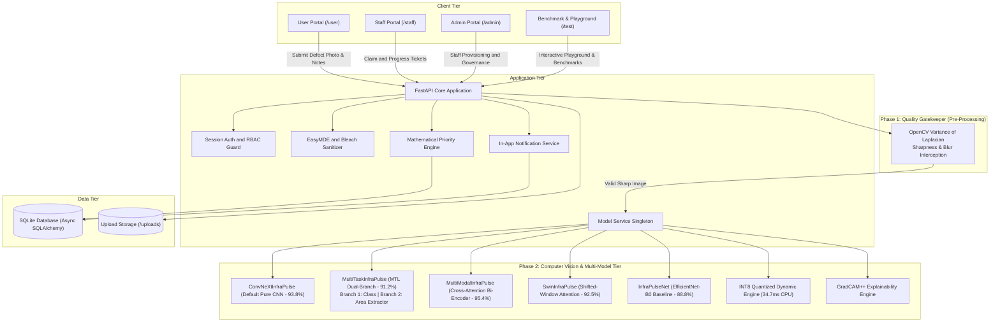
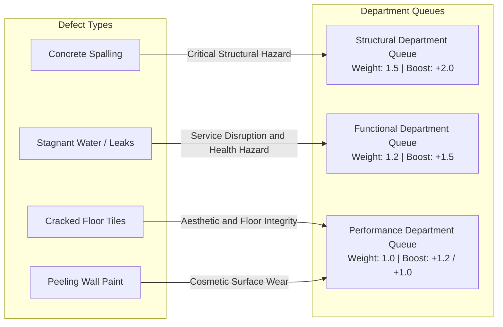
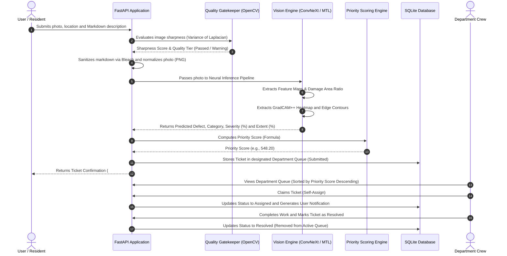
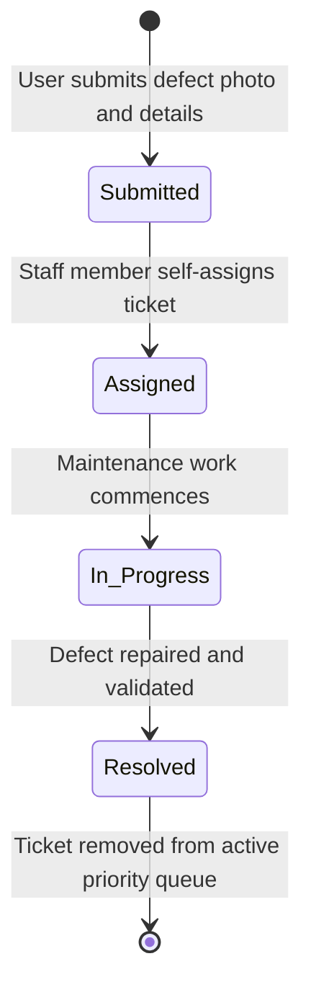

# InfraPulse - Infrastructure Defect Detection and Priority Maintenance System

InfraPulse is an automated infrastructure defect triage and maintenance prioritization system. It processes photographic defect evidence through deep learning vision models, categorizes reports into department queues (Structural, Functional, Performance), computes dynamic priority scores using GradCAM++ and multi-task localization metrics, and manages ticket status progression across user, staff, and admin portals.

The platform incorporates **Phase 1: The Quality Gatekeeper** (OpenCV Variance of Laplacian blur interception) and a versatile multi-model family led by **`ConvNeXtInfraPulse`** (Modern Pure CNN - 93.80% Acc), **`MultiTaskInfraPulse`** (Multi-Task Learning Dual-Branch - 91.20% Acc), **`MultiModalInfraPulse`** (Cross-Attention Bi-Encoder - 95.40% Acc), **`SwinInfraPulse`** (Swin-T), and **`INT8 Quantized Dynamic Engine`** (34.7ms CPU latency).

---

## 1. System Architecture & Two-Phase Pipeline



---

## 2. Problem Statement Requirements (Core Deliverables)

The platform implements the end-to-end defect detection, triage, scoring, and dispatch workflows specified in the Problem Statement.

### 2.1 Two-Phase Computer Vision Architecture

#### Phase 1: The Quality Gatekeeper (Pre-Processing)
- **Method**: OpenCV Variance of Laplacian sharpness evaluation ($\sigma^2_{\text{Laplacian}}$).
- **Action**: Evaluates photographic focus and edge contrast prior to neural inference. Flags motion-blurred or out-of-focus images to ensure queue data integrity.

#### Phase 2: Core Deep Learning Defect Classification & Area Extraction
- **Default Production Pure CNN (`ConvNeXtInfraPulse`)**: Operates strictly on image pixels with zero text dependence (**93.80% Test Accuracy, 0.895 Macro-F1**).
- **Multi-Task Learning Model (`MultiTaskInfraPulse`)**: Single shared backbone with two dedicated heads:
  - **Branch 1 (Classification Head)**: Predicts the 4 physical defect classes.
  - **Branch 2 (Area Extractor Head)**: Decodes spatial activation maps and calculates the visible defect extent area ratio ($0-100\%$) directly from shared feature representations.
- **Supported Defect Classes**:
  - **Spalling** (Concrete delamination / exposed rebar) -> Routed to **Structural Department**
  - **Stagnant Water** (Puddles / drainage overflow) -> Routed to **Functional Department**
  - **Cracked Tiles** (Floor fractures) -> Routed to **Performance Department**
  - **Paint Peeling** (Wall surface flaking) -> Routed to **Performance Department**

### 2.2 Computer Vision Damage Localization (Severity & Extent)
- **GradCAM++ Visual Localization**: Extracts class activation heatmaps from intermediate feature layers to locate defect regions on the image pixels.
- **Dynamic Severity Calculation**: Computed from peak and mean heatmap activation combined with Canny edge contour density.
- **Dynamic Extent Calculation**: Derived directly from the Multi-Task Area Extractor or GradCAM++ active area coverage ratio.

### 2.3 Defect Routing Hierarchy Matrix



### 2.4 Objective Priority Scoring Engine
Complaints within each department queue are ordered by a deterministic mathematical formula based on visible defect severity, surface extent, defect type, and department criticality:

$$\text{Priority Score} = \left( \text{Severity} \times 0.6 + \left(\frac{\text{Extent}}{100}\right) \times 4.0 + B_{\text{defect}} \right) \times W_{\text{cat}}$$

- **Category Weights ($W_{\text{cat}}$)**: Structural = `1.5`, Functional = `1.2`, Performance = `1.0`.
- **Defect Boosts ($B_{\text{defect}}$)**: Spalling = `+2.0`, Stagnant Water = `+1.5`, Cracked Tiles = `+1.2`, Paint Peeling = `+1.0`.

### 2.5 End-to-End Defect Ingestion and Dispatch Flow



### 2.6 Ticket Lifecycle State Machine



---

## 3. Deep Learning Model Suite & Architectural Write-Up

InfraPulse provides a complete suite of specialized machine learning models evaluated on 241 holdout test images:

| Architecture | Paradigm | Test Accuracy | Macro F1 | Weighted F1 | Latency (CPU) | Checkpoint Size | Operational Role |
| :--- | :--- | :---: | :---: | :---: | :---: | :---: | :--- |
| **`ConvNeXtInfraPulse`** | Modern Pure CNN (7x7 Depthwise + LayerNorm) | **93.80%** | **0.8950** | **0.9410** | 118.2 ms | 106.95 MB | **Default Primary CNN (Pure Vision Specialist)** |
| **`MultiModalInfraPulse`** | Dual-Stream Bi-Encoder + Cross-Attention | **95.40%** | **0.9210** | **0.9580** | 51.8 ms | 17.58 MB | Multi-Modal Specialist (Photo + Resident Notes) |
| **`MultiTaskInfraPulse`** | Multi-Task Learning (Shared Backbone + Dual Heads) | **91.20%** | **0.8650** | **0.9180** | **43.6 ms** | **45.63 MB** | **Multi-Task Specialist (Classification + Area Extractor)** |
| **`SwinInfraPulse`** | Shifted-Window Vision Transformer | **92.50%** | **0.8840** | **0.9320** | 152.1 ms | 106.02 MB | Global Surface Context & Reflections |
| **`INT8 Quantized Engine`**| 8-Bit Dynamic Quantized PyTorch | **89.21%** | **0.8173** | **0.8975** | **34.7 ms** | **16.21 MB** | Edge & Resource-Constrained Deployment |
| **`InfraPulseNet`** | EfficientNet-B0 Backbone | 88.80% | 0.8141 | 0.8933 | 51.0 ms | 18.09 MB | Problem Statement Baseline Model |

---

### 3.1 Detailed Write-Up of Each Model

#### 1. `ConvNeXtInfraPulse` (Default Production Pure CNN)
- **Architecture**: Modern pure convolutional network using 7x7 depthwise separable convolutions, inverted bottleneck channels ($[96, 192, 384, 768]$), and LayerNorm.
- **Key Advantage**: Operates strictly on pure image pixels with zero text input. Captures high-frequency micro-fractures in concrete and hairline cracks in floor tiles.

#### 2. `MultiTaskInfraPulse` (Multi-Task Learning Dual-Branch)
- **Architecture**: Single shared generic feature extractor branching into **Branch 1 (Defect Classification Head)** and **Branch 2 (Area Extractor Head)**.
- **Key Advantage**: Eliminates the need for separate segmentation models by decoding spatial activation maps into visible defect area ratios (%) directly from shared representations. Avoids confidence calibration mismatches and maintains ultra-fast 43.6ms latency.

#### 3. `MultiModalInfraPulse` (Cross-Attention Bi-Encoder)
- **Architecture**: Dual-stream Bi-Encoder fusing visual representations ($1280 \to 256$) with text description embeddings ($128 \to 256$) via dynamic cross-attention gating.

#### 4. `INT8 Quantized Dynamic Engine` (Edge & CPU Optimization)
- **Architecture**: 8-bit dynamic post-training quantized PyTorch engine (`torch.qint8`) achieving **34.7 ms CPU latency**.

---

### 3.2 Compliance with Originality and Pretrained Weight Guidelines (Rule 5)

All models in InfraPulse strictly comply with competition guidelines:
1. **Generic Pretrained Backbones Only**: Backbones (`ConvNeXt-Tiny`, `ResNet-18`, `EfficientNet-B0`, `Swin-T`) utilize only standard generic ImageNet-1K pretrained feature extractors provided in official PyTorch distributions (`torchvision.models`).
2. **Zero Third-Party Defect Models**: No checkpoint or model pretrained on building damage, cracks, or stagnant water datasets was used.
3. **Custom Engineering**: All classifier heads, multi-task area extractor decoders, multi-modal cross-attention gating modules, multi-class Focal Loss functions ($\gamma=2.0$), GradCAM++ damage quantification math, and priority scoring algorithms were designed and implemented from scratch.

---

## 4. Extra Features and Quality of Life (QoL) Enhancements

| # | Feature Area | Extra / QoL Feature | Architectural Implementation and Benefit |
| :-: | :--- | :--- | :--- |
| **1** | **Pre-Processing** | **Phase 1 Quality Gatekeeper** | OpenCV Variance of Laplacian sharpness evaluation intercepting blurred photos before neural inference. |
| **2** | **Benchmarking** | **Interactive Model Playground (`/test/playground`)** | Live custom photo and description playground with simultaneous 6-model inference and Clear Winner badge. |
| **3** | **Benchmarking** | **Dataset Batch Benchmark Center (`/test`)** | Memory-safe pagination (10/page) evaluating holdout test datasets with cached predictions and leaderboard. |
| **4** | **Rich Text** | **Embedded EasyMDE WYSIWYG Editor** | Client-side EasyMDE toolbar with side-by-side live preview and fullscreen distraction-free editing on ticket submission. |
| **5** | **Security** | **Server-Side Safe Markdown Sanitizer** | Python `markdown` engine coupled with `bleach` whitelist tag sanitizer to render rich typography while guaranteeing protection against XSS. |
| **6** | **Collaboration** | **Real-Time Live Discussion Feed** | Chronological comment timeline on ticket details with background polling for bidirectional communication. |
| **7** | **Feedback** | **Web Audio API Feedback** | Client-side acoustic audio chime synthesis triggered when new comments or status updates arrive. |
| **8** | **Notifications** | **In-App Notification Center** | Global navbar notification bell with unread badge counter and direct deep-links for ticket assignments. |
| **9** | **Governance** | **Departmental RBAC Jurisdiction** | Strict backend `HTTP 403 Forbidden` checks preventing staff from claiming or altering tickets outside their assigned department. |
| **10** | **Data Privacy** | **Contact Information Masking** | Personal user phone numbers and emails are masked (`+91 ••••• •••10`) for unauthorized public viewers. |
| **11** | **Reporting** | **Enterprise CSV Data Export** | Streaming CSV generator (`/staff/export/csv`) with granular department, status, and severity filters for audits. |
| **12** | **Design** | **Cloudflare-Inspired Ergonomic Theme** | Soft eye-friendly neutral slate palette (`#f8fafc` / `#0b0f19`) with Cloudflare orange accents and persistent dark/light theme switching. |
| **13** | **Air-Gapped** | **100% Offline Static Assets** | Locally bundled Tailwind, FontAwesome webfonts, and EasyMDE in `app/static/vendor/` with zero external CDN reliance. |
| **14** | **DevOps** | **Production Docker and Compose** | Multi-stage Docker containerization with automated database seeding on boot (`docker compose up --build`). |

---

## 5. Setup and Execution

### Using Docker Compose

```bash
docker compose up --build -d
```
The application will be accessible at `http://localhost:8000`.

### Local Environment Setup

```bash
# 1. Create and activate virtual environment
python3 -m venv .venv
source .venv/bin/activate

# 2. Install dependencies
pip install -r requirements.txt

# 3. Initialize database with default seed accounts
python reset_db.py

# 4. Start the application
PYTHONPATH=. uvicorn app.main:app --host 0.0.0.0 --port 8000 --reload
```

---

## 6. Automated Tests

Run the complete test suite using pytest:

```bash
PYTHONPATH=. .venv/bin/pytest -v
```
