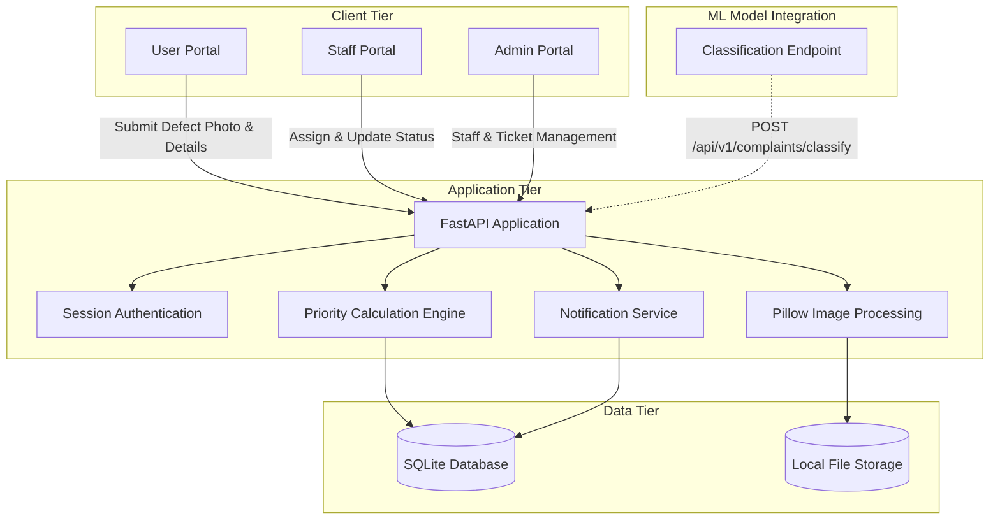
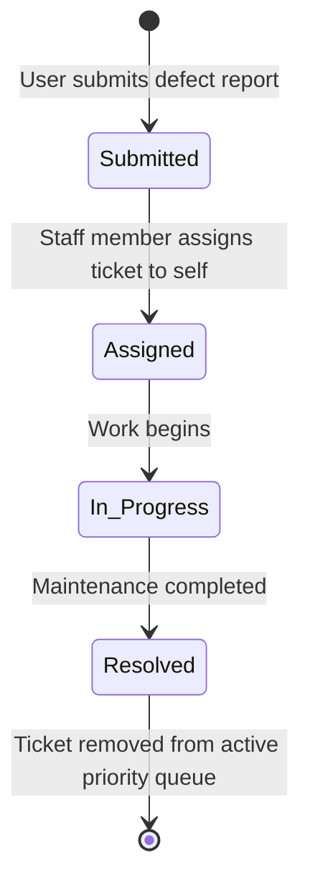
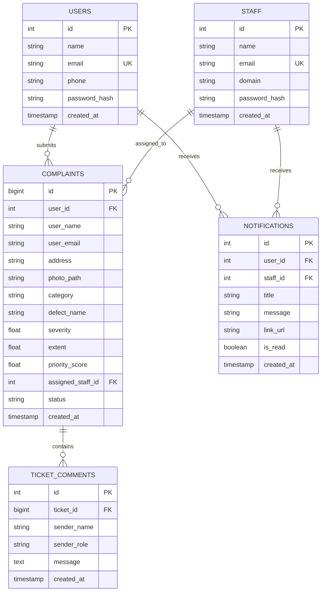

# InfraPulse - Infrastructure Defect Detection and Priority Maintenance System

InfraPulse is a web-based defect detection and maintenance prioritization system. It categorizes infrastructure defect photographs into designated department queues (Structural, Functional, Performance), computes priority scores based on visible defect severity and extent, and manages ticket status progression across user, staff, and admin interfaces.

---

## Architecture



---

## Ticket Lifecycle and Defect Routing



---

## Priority Scoring Formulation

Complaints are sorted within category queues using a weighted mathematical formula based on visible defect severity, surface extent, defect type, and category weight:

$$\text{Priority Score} = \left( \text{Severity} \times 0.6 + \left(\frac{\text{Extent}}{100}\right) \times 4.0 + B_{\text{defect}} \right) \times W_{\text{cat}}$$

### Category Weights ($W_{\text{cat}}$)
- **Structural**: 1.5
- **Functional**: 1.2
- **Performance**: 1.0

### Defect Boost Factors ($B_{\text{defect}}$)
| Defect Type | Category | Boost ($B_{\text{defect}}$) | Priority Hierarchy |
| :--- | :--- | :---: | :--- |
| **Spalling** | Structural | +2.0 | Highest priority |
| **Stagnant Water** | Functional | +1.5 | High priority |
| **Cracked Tiles** | Performance | +1.2 | Medium priority (above paint peeling) |
| **Paint Peeling** | Performance | +1.0 | Standard priority |

---

## Additional System Capabilities

Beyond the baseline requirements, the implementation includes:

1. **Ticket Activity and Chat Timeline**: In-app communication on ticket detail pages with background polling and Web Audio API audio indicators.
2. **Notification Center**: Navigation bar dropdown providing updates when staff assign tickets or update ticket statuses.
3. **Contact Privacy Masking**: Masking of personal contact information (phone number, email) for unauthorized visitors on ticket detail pages.
4. **Image Format Normalization**: Automatic conversion of uploaded image formats (JPEG, WEBP, BMP) to PNG format.
5. **CSV Queue Export**: Capability for staff and administrators to export active queue records to CSV.
6. **Department Queue Defaulting**: Staff dashboards default to displaying tickets in their assigned domain.
7. **Domain Access Control**: Restrictions preventing staff from modifying tickets belonging to other domain categories.
8. **Self-Contained Static Assets**: Locally bundled Tailwind CSS, DaisyUI, and FontAwesome assets for environments without internet access.

---

## Database Schema



---

## Setup and Execution

### Using Docker Compose

```bash
docker compose up --build -d
```
The application will be available at `http://localhost:8000`.

### Local Environment Setup

```bash
# 1. Create and activate virtual environment
python3 -m venv .venv
source .venv/bin/activate

# 2. Install dependencies
pip install -r requirements.txt

# 3. Initialize database with default seed accounts
python reset_db.py

# 4. Start the application
PYTHONPATH=. uvicorn app.main:app --host 0.0.0.0 --port 8000 --reload
```

---

## Default Accounts

| Portal | Email | Password | Role / Department |
| :--- | :--- | :--- | :--- |
| **User Portal** | `user@infrapulse.org` | `user123` | Registered User |
| **Structural Staff** | `structural@infrapulse.org` | `staff123` | Structural Department |
| **Functional Staff** | `functional@infrapulse.org` | `staff123` | Functional Department |
| **Performance Staff** | `performance@infrapulse.org` | `staff123` | Performance Department |
| **Admin Portal** | `admin@infrapulse.org` | `admin123` | Administrator |

---

## Machine Learning Integration Endpoint

External classification scripts can send defect analysis results via the REST endpoint:

```http
POST /api/v1/complaints/{complaint_id}/classify
Content-Type: application/json

{
  "defect_name": "Spalling",
  "category": "Structural",
  "severity": 8.5,
  "extent": 45.0
}
```

---

## Automated Tests

Run the test suite using pytest:

```bash
PYTHONPATH=. .venv/bin/pytest -v
```

---

## Project Structure

```text
InfraPulse/
├── Dockerfile                  # Container definition
├── docker-compose.yml          # Container composition
├── schema.sql                  # Database DDL schema and indexes
├── reset_db.py                 # Database initialization and seeding script
├── requirements.txt            # Python dependencies
├── app/
│   ├── main.py                 # Application factory and route registration
│   ├── config.py               # Configuration constants and weights
│   ├── database.py             # Database connection and session handling
│   ├── models.py               # Database ORM models
│   ├── auth.py                 # Authentication and password verification
│   ├── priority_queue.py       # Priority score calculations and queue filters
│   ├── routers/
│   │   ├── user.py             # User ticket submission and detail routes
│   │   ├── staff.py            # Staff queue management and CSV export
│   │   ├── admin.py            # Admin staff and ticket management
│   │   └── api.py              # API endpoints for comments, notifs, and ML
│   ├── static/
│   │   ├── vendor/             # Local copies of CSS/JS/font assets
│   │   └── uploads/            # Uploaded defect images
│   └── templates/              # Jinja2 HTML templates
├── docs/
│   ├── InfraPulse.pdf          # Problem statement specification
│   ├── DESIGN_DOCUMENT.md      # High-Level and Low-Level Design Document
│   └── DOCUMENTATION_REPORT.md # Technical documentation report
└── tests/
    └── test_app.py             # Automated test suite
```
