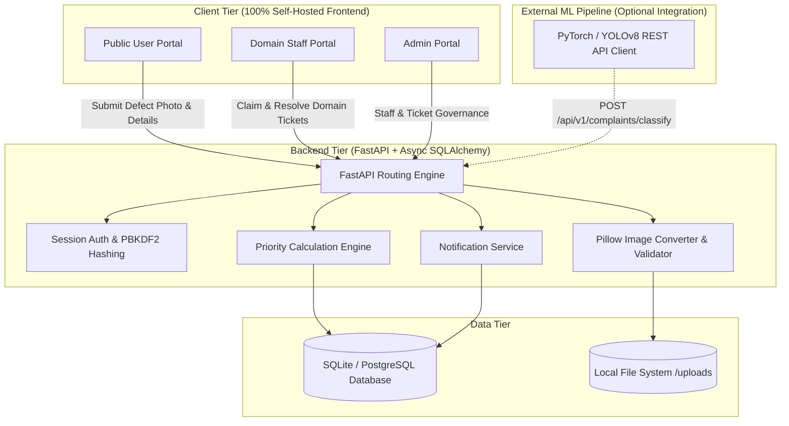
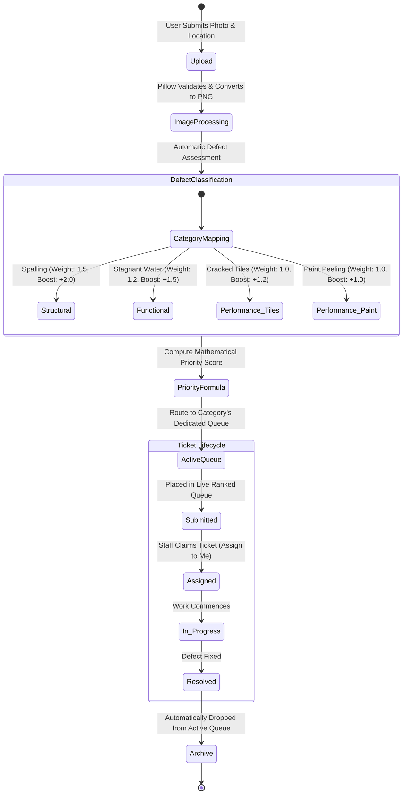
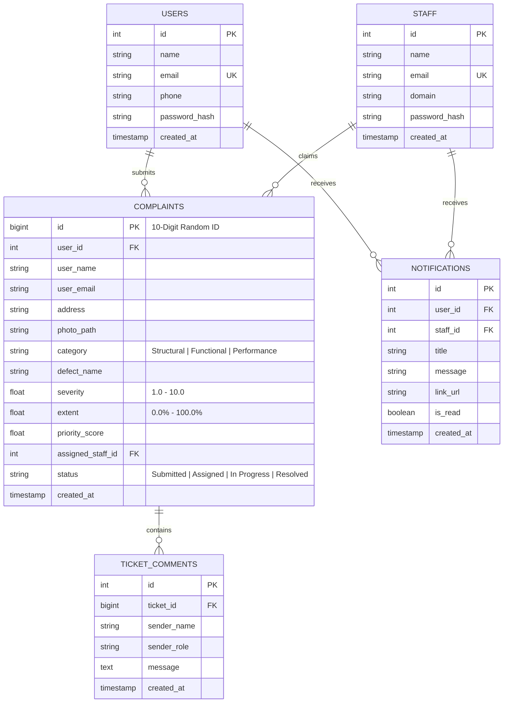

# 🛡️ InfraPulse - Infrastructure Defect Detection & Priority Maintenance System

[](https://www.python.org/)
[](https://fastapi.tiangolo.com/)
[](https://www.sqlite.org/)
[](https://www.docker.com/)
[](https://tailwindcss.com/)

**InfraPulse** is an automated photo-based infrastructure defect detection and priority maintenance platform built for **Takneek PS**. It eliminates manual bottleneck reporting by automatically classifying uploaded defect photographs into dedicated domain queues (**Structural**, **Functional**, **Performance**), mathematically scoring priority rank based on visible severity and coverage extent, and managing end-to-end ticket lifecycle dispatching for campus maintenance squads.

---

## 🏛️ System Architecture



---

## 🔄 Defect Routing & Priority Queue State Machine



---

## 📐 Priority Queue Mathematical Formulation

As required by the specification, complaints are ranked dynamically within each domain queue using an objective mathematical formulation accounting for visible defect severity, surface extent coverage, defect hazard hierarchy, and domain criticality:

$$\text{Priority Score} = \left( \text{Severity} \times 0.6 + \left(\frac{\text{Extent}}{100}\right) \times 4.0 + B_{\text{defect}} \right) \times W_{\text{cat}}$$

### 1. Domain Category Criticality Weight ($W_{\text{cat}}$)
- **Structural**: `1.5` (Critical structural safety integrity)
- **Functional**: `1.2` (Plumbing, drainage, stagnant water issues)
- **Performance**: `1.0` (Aesthetics, surface finishes, floor tiles)

### 2. Defect Hierarchy Boost ($B_{\text{defect}}$)
| Defect Type | Domain Category | Defect Priority Boost ($B_{\text{defect}}$) | Description |
| :--- | :--- | :---: | :--- |
| **Spalling** | **Structural** | `+2.0` | Concrete surface peeling exposing internal rebar |
| **Stagnant Water** | **Functional** | `+1.5` | Flooding, drainage blockage, and hygiene risk |
| **Cracked Tiles** | **Performance** | `+1.2` | Tripping hazard and flooring breakage |
| **Paint Peeling** | **Performance** | `+1.0` | Wall coating degradation and aesthetic defect |

> **Hierarchy Guarantee**: $\text{Spalling (Structural)} > \text{Stagnant Water (Functional)} > \text{Cracked Tiles (Performance)} > \text{Paint Peeling (Performance)}$.

---

## 🗄️ Relational Database Schema Overview

InfraPulse utilizes an asynchronous SQLite database defined in [schema.sql](schema.sql):



---

## 🚀 Quick Start & Deployment

### Option A: Running with Docker Compose (Recommended)

```bash
# Clone the repository
git clone https://github.com/Bittu5134/InfraPulse.git
cd InfraPulse

# Build and start containerized application
docker compose up --build -d
```
The application will be accessible at `http://localhost:8000`.

### Option B: Local Python Virtual Environment

```bash
# 1. Clone & create virtual environment
git clone https://github.com/Bittu5134/InfraPulse.git
cd InfraPulse
python3 -m venv .venv
source .venv/bin/activate

# 2. Install dependencies
pip install -r requirements.txt

# 3. Reset database and seed default demo accounts
python reset_db.py

# 4. Launch development server
PYTHONPATH=. uvicorn app.main:app --host 0.0.0.0 --port 8000 --reload
```

---

## 🔑 Pre-Seeded Demo Accounts

| Portal | Email | Password | Role / Domain |
| :--- | :--- | :--- | :--- |
| **User Portal** | `user@infrapulse.org` | `user123` | Registered Public User |
| **Structural Staff** | `structural@infrapulse.org` | `staff123` | Structural Maintenance Squad |
| **Functional Staff** | `functional@infrapulse.org` | `staff123` | Functional Maintenance Squad |
| **Performance Staff** | `performance@infrapulse.org` | `staff123` | Performance Maintenance Squad |
| **Admin Portal** | `admin@infrapulse.org` | `admin123` | System Administrator |

---

## 🔌 External ML Inference REST API

External models (e.g. YOLOv8, Faster R-CNN, or ResNet) can push inference results directly into the priority queue via the REST API:

```http
POST /api/v1/complaints/{complaint_id}/classify
Content-Type: application/json

{
  "defect_name": "Spalling",
  "category": "Structural",
  "severity": 8.5,
  "extent": 45.0
}
```

**Response**:
```json
{
  "status": "success",
  "complaint_id": 8492019482,
  "category": "Structural",
  "defect_name": "Spalling",
  "priority_score": 13.95,
  "message": "Complaint classified and priority score updated"
}
```

---

## 🧪 Automated Testing Suite

InfraPulse includes full end-to-end integration and unit tests covering priority math, image conversion, user registration, staff claiming, domain security restrictions, and admin oversight:

```bash
PYTHONPATH=. .venv/bin/pytest -v
```

---

## 📁 Repository Structure

```text
InfraPulse/
├── Dockerfile                  # Production container definition
├── docker-compose.yml          # Container orchestration configuration
├── schema.sql                  # Relational database DDL schema & indexes
├── reset_db.py                 # Clean database reset & seeding utility
├── requirements.txt            # Python dependencies
├── app/
│   ├── main.py                 # FastAPI application factory & routes
│   ├── config.py               # Weights, boosts, & environment configuration
│   ├── database.py             # Asynchronous SQLAlchemy engine & sessionmaker
│   ├── models.py               # SQLAlchemy ORM models
│   ├── auth.py                 # Password hashing & session protection
│   ├── priority_queue.py       # Mathematical priority engine & queue sorters
│   ├── routers/
│   │   ├── user.py             # User registration, submission, & ticket tracking
│   │   ├── staff.py            # Staff queue management, actions, & CSV export
│   │   ├── admin.py            # Administrative staff and ticket oversight
│   │   └── api.py              # REST API endpoints (comments, notifs, ML ingest)
│   ├── static/
│   │   ├── vendor/             # 100% self-hosted Tailwind, DaisyUI & FontAwesome
│   │   └── uploads/            # Standardized PNG defect photo storage
│   └── templates/              # Jinja2 responsive HTML templates
├── docs/
│   ├── InfraPulse.pdf          # Official problem statement specification
│   ├── DOCUMENTATION_REPORT.md # Technical documentation report deliverable
│   └── walkthrough.md          # Step-by-step feature walkthrough log
└── tests/
    └── test_app.py             # Pytest automated test suite
```

---

## ⚖️ License & Attribution
Developed for the **Takneek PS** Infrastructure Defect Priority Maintenance Web System competition. Built with 100% self-contained, open-source libraries.
