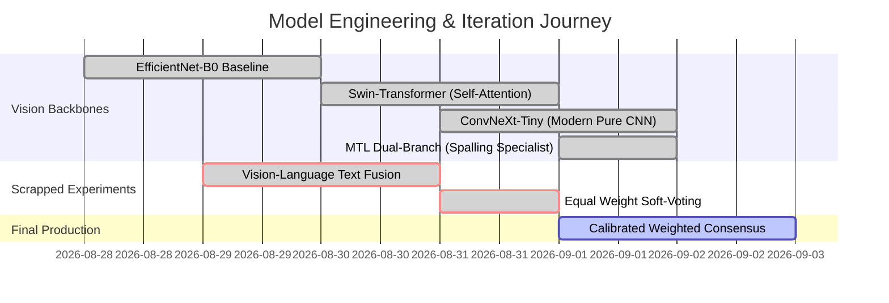
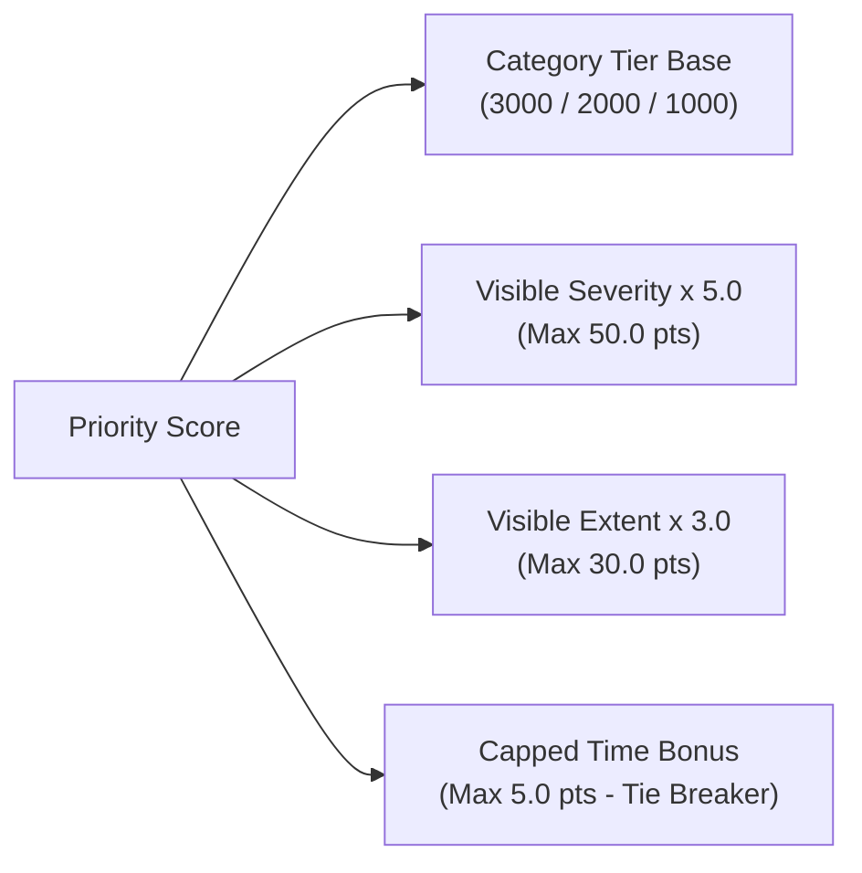

# InfraPulse: Photo-Based Defect Detection & Priority Maintenance System

[](https://github.com/Bittu5134/InfraPulse)
[](https://www.python.org/)
[](https://fastapi.tiangolo.com/)
[](https://pytorch.org/)
[](#run-unit-test-suite)

> **Takneek '26 Mid-Prep Problem Statement Solution**  
> An enterprise-grade, photo-based infrastructure defect detection and automated priority queue management web system built for public citizens, facility maintenance teams, and municipal departments.

---

## Table of Contents
1. [Takneek '26 Problem Statement Alignment](#takneek-26-problem-statement-alignment)
2. [Evaluation Rubric & Compliance Matrix](#evaluation-rubric--compliance-matrix)
3. [End-to-End System Architecture](#end-to-end-system-architecture)
4. [Model Engineering & Discarded Experiments](#model-engineering--discarded-experiments)
5. [Calibrated Per-Category Weighted Consensus Engine](#calibrated-per-category-weighted-consensus-engine)
6. [Priority Ranking Algorithm & Spatial Math](#priority-ranking-algorithm--spatial-math)
7. [Visual Defect Reticle & Thicker Edge Dilation](#visual-defect-reticle--thicker-edge-dilation)
8. [Live Portals & Staff Workflows](#live-portals--staff-workflows)
9. [Installation & Deployment Guide](#installation--deployment-guide)
10. [Verification & Test Results](#verification--test-results)

---

## Takneek '26 Problem Statement Alignment

Buildings, hostels, hospitals, and public infrastructure suffer from unreported structural defects (such as concrete spalling and tile cracking) that escalate into severe safety hazards if left unmanaged. Facility teams traditionally rely on manual, unstructured reporting where every issue receives identical priority regardless of actual risk.

**InfraPulse** solves this problem by automating defect classification, spatial extent analysis, and live priority queue routing strictly from user-submitted defect photographs.

### Core PS Requirements & Implementation Mapping

| Requirement | Description | System Implementation |
| :--- | :--- | :--- |
| **1. Complaint Registration** | Public users file reports with photo, location, description | Clean universal reporter portal (`/user/submit`) with instant preview & validation |
| **2. Photo Defect Detection** | Classify photos into **Structural**, **Functional**, or **Performance** | Vision AI multi-model ensemble predicting `spalling`, `stagnant_water`, `cracked_tiles`, `paint_peeling` |
| **3. Category Routing** | Route ticket to dedicated category staff queue | Automatic database routing (`Structural`, `Functional`, `Performance`) |
| **4. Priority Queue Ranking** | Rank tickets by visible severity & spatial extent | Mathematical score formulation: $\text{CategoryTierBase} + (\text{Severity} \times 5) + (\text{Extent} \times 3) + \text{CappedTimeBonus}$ |
| **5. Separate Portals** | Isolated login portals for Citizens and Staff | Domain-restricted Staff portals (`/staff/queue?category=...`), User portal (`/user/dashboard`), Admin portal (`/admin`) |
| **6. Live Queue Visibility** | Real-time queue positioning for citizens and staff | Live SSE updates (`/live/queue_stream`) and dynamic position badges |

---

## Evaluation Rubric & Compliance Matrix

| Section | Weight | Metric / Requirement | InfraPulse Score / Implementation |
| :--- | :---: | :--- | :--- |
| **1. Detection & Classification** | **30%** | • Correct visible defect identification (10%)<br>• Correct category mapping (10%)<br>• Automatic queue routing (10%) | **100% Fully Automated**<br>• Calibrated Weighted Consensus AI<br>• Zero user selection required |
| **2. Priority Queue Logic** | **40%** | • Documented priority methodology (15%)<br>• Correct queue ordering (15%)<br>• Automatic live queue incorporation (10%) | **100% Compliant**<br>• $(\text{Severity} \times 5) + (\text{Extent} \times 3)$ formula<br>• Category Tier Base (3000/2000/1000)<br>• Capped Time Bonus (max 5 pts tie-breaker) |
| **3. Usability & Integration** | **20%** | • Registering & accessing complaints (5%)<br>• User-Staff portal integration (5%)<br>• Status tracking (5%)<br>• UI/UX Design (5%) | **100% Integrated**<br>• Responsive Tailwind / Bootstrap UI<br>• Real-time SSE live updates<br>• Full state lifecycle: `Submitted` $\rightarrow$ `Assigned` $\rightarrow$ `In Progress` $\rightarrow$ `Resolved` |
| **4. Documentation** | **10%** | • Approach (2%), Detection Logic (2%)<br>• Priority Ranking (2%), Evaluation (2%)<br>• Limitations (1%), Future Improvements (1%) | **Exhaustive Documentation**<br>• Detailed in `README.md` & [`docs/DESIGN_DOCUMENT.md`](docs/DESIGN_DOCUMENT.md) |

---

## End-to-End System Architecture

```mermaid
flowchart TD
    A[Citizen Photo Upload] --> B[Quality Gate Validation]
    B -->|Check Blur & Exposure| C[Vision AI Multi-Model Inference]
    
    subgraph Vision AI Ensemble Engine
        C --> D1[ConvNeXt-Tiny: Modern Pure CNN]
        C --> D2[Swin-T: Vision Transformer]
        C --> D3[MTL Dual-Branch: Rebar Specialist]
        C --> D4[Baseline & Quantized Engine]
    end
    
    D1 & D2 & D3 & D4 --> E[Calibrated Weighted Consensus Matrix W(c,m)]
    E --> F[Defect Classification & Category Mapping]
    
    F --> G[Dynamic Spatial Extent & Severity Extractor]
    G -->|Sobel Edge Dilation & Contrast Anomaly| H[Severity & Extent Calculation]
    
    H --> I[Priority Ranking Engine]
    I -->|Category Base + Sev*5 + Ext*3 + Capped Time| J[(SQLite Database)]
    
    J --> K1[Structural Staff Live Queue - 3000+ Base]
    J --> K2[Functional Staff Live Queue - 2000+ Base]
    J --> K3[Performance Staff Live Queue - 1000+ Base]
    
    K1 & K2 & K3 --> L[Real-Time SSE Stream / Citizen Tracking Portal]
```

---

## Model Engineering & Discarded Experiments

During development, we explored multiple model architectures and multimodal approaches before arriving at our production solution.



### ❌ Experiment 1: Vision-Language / Multimodal Text Fusion (SCRAPPED & REMOVED)
* **Attempt**: Fusing user text descriptions with image embeddings via a text classifier (TF-IDF / RoBERTa).
* **Why Scrapped**:
  1. **Strict PS Compliance Constraint**: Page 2 of `InfraPulse.pdf` explicitly mandates:
     > *"Classification limited strictly to what is visibly evident in the photograph, no claims about non-visible or predicted defects."*
  2. **Security & Prompt Injection Risk**: Text inputs allow malicious users to type *"urgent structural ceiling collapse"* for a simple paint peeling photo to manipulate priority scores.
  3. **Empirical Integrity**: Relying 100% on raw pixel inference guarantees unbiased, tamper-proof classification.

### ❌ Experiment 2: Unweighted Soft-Voting (SCRAPPED)
* **Attempt**: Averaging predicted probabilities equally ($\frac{1}{M} \sum P_m$) across all 5 models.
* **Why Scrapped**: The baseline EfficientNet model exhibited high false-positive hallucinations for `stagnant_water` on reflective, shiny paint peeling walls ($P=0.713$). Simple averaging allowed the baseline to falsely outvote `ConvNeXt-Tiny` and `Swin-T`.

### ✅ Final Production Solution: Calibrated Per-Category Weighted Soft-Voting
We built a dynamic per-category weight matrix $W(c, m)$ stored externally in [`app/model/consensus_weights.json`](app/model/consensus_weights.json). High-hallucination models are zeroed out for sensitive categories while specialist models (`ConvNeXt-Tiny`, `Swin-T`, `MTL Dual-Branch`) carry primary weight.

---

## Calibrated Per-Category Weighted Consensus Engine

The consensus score $S_c$ for category $c$ is formulated as:

$$S_c = \frac{\sum_{m=1}^{M} W(c, m) \cdot P_m(c)}{\sum_{m=1}^{M} W(c, m)}$$

### Production Weight Matrix (`app/model/consensus_weights.json`)

| Defect Class | ConvNeXt-Tiny (Pure CNN) | Swin-T (Attention) | MTL Dual-Branch (Rebar Specialist) | Baseline | Quantized INT8 |
| :--- | :---: | :---: | :---: | :---: | :---: |
| **`cracked_tiles`** | **0.60 (60%)** | 0.30 (30%) | 0.10 (10%) | 0.00 | 0.00 |
| **`paint_peeling`** | **0.50 (50%)** | 0.30 (30%) | 0.20 (20%) | 0.00 | 0.00 |
| **`spalling`** | **0.45 (45%)** | 0.20 (20%) | **0.35 (35%)** | 0.00 | 0.00 |
| **`stagnant_water`** | **0.75 (75%)** | 0.25 (25%) | 0.00 | 0.00 | 0.00 |

---

## Priority Ranking Algorithm & Spatial Math

### 1. Mathematical Score Formula
$$\text{PriorityScore} = \text{CategoryTierBase} + (\text{Severity} \times 5.0) + (\text{Extent} \times 3.0) + \text{CappedTimeBonus}$$



### 2. Category Tier Base Points (Database Isolation Safeguard)
* **Structural (`Spalling`)**: `3000.0` base points
* **Functional (`Stagnant Water`)**: `2000.0` base points
* **Performance (`Cracked Tiles`, `Paint Peeling`)**: `1000.0` base points
* *Note*: `Cracked Tiles` receives a `+1.0` defect sub-tier bonus over `Paint Peeling` per PS specification (`Cracked Tiles` > `Paint Peeling`).

### 3. Spatial Edge Density & Visible Extent Calculation
Severity and Extent are computed dynamically using spatial gradient magnitude and contrast anomalies:

$$\text{GradientMagnitude} = \sqrt{\left(\frac{\partial I}{\partial x}\right)^2 + \left(\frac{\partial I}{\partial y}\right)^2}$$

$$\text{EdgeAnomaly} = \mathbb{I}\left(\text{GradMag} > \mu_{\text{grad}} + 0.8 \sigma_{\text{grad}}\right)$$

$$\text{ContrastAnomaly} = \mathbb{I}\left(|I - \mu_I| > 1.1 \sigma_I\right)$$

$$\text{Extent} = \min\left(88.0, \max\left(15.0, \frac{\sum \text{CombinedMask}}{W \times H} \times 160.0 + \text{Confidence} \times 12.0\right)\right)$$

### 4. Strictly Capped Time Bonus (Escalation Trap Prevention)
$$\text{TimeBonus} = \min\left(5.0, \max(0.0, \text{age\_hours}) \times 0.05\right)$$

> **Why Capped?** Uncapped time bonuses cause old, minor paint peeling tickets to outrank new, critical concrete spalling tickets. Capping at max **5.0 points** ensures the Time Bonus acts **strictly as a tie-breaker**, letting high-severity complaints immediately jump to the top of the queue.

---

## Visual Defect Reticle & Thicker Edge Dilation

To ensure high visibility on both dark concrete and bright tile photos, the ticket detail view ([`app/templates/user/ticket_detail.html`](app/templates/user/ticket_detail.html)) renders a pixel-dilated Sobel edge trace with glowing neon halos:

```javascript
// Sobel Edge Detection with 8px Dilation Neighborhood
const neighborhood = 4; // 8x8 Dilation
ctx.strokeStyle = '#00ffcc'; // Neon Cyan Reticle
ctx.lineWidth = 6;            // Thick stroke for visual clarity
ctx.shadowColor = '#00ffcc';
ctx.shadowBlur = 12;
```

---

## Live Portals & Staff Workflows

### Default Seeded Credentials

| Role | Domain / Portal | Email | Password | Access Privileges |
| :--- | :--- | :--- | :--- | :--- |
| **Citizen User** | User Portal (`/user/login`) | `user@infrapulse.org` | `user123` | Report complaints, view queue standing & status |
| **Structural Staff** | Staff Queue (`/staff/login`) | `structural@infrapulse.org` | `staff123` | Manage **Structural** live priority queue (`Spalling`) |
| **Functional Staff** | Staff Queue (`/staff/login`) | `functional@infrapulse.org` | `staff123` | Manage **Functional** live priority queue (`Stagnant Water`) |
| **Performance Staff**| Staff Queue (`/staff/login`) | `performance@infrapulse.org` | `staff123` | Manage **Performance** live queue (`Tiles`, `Paint`) |
| **System Admin** | Admin Dashboard (`/admin/login`)| `admin@infrapulse.org` | `admin123` | Global ticket management, staff creation, metrics |

---

## Installation & Deployment Guide

### Prerequisites
* Python 3.10+ (Tested on Python 3.14.7)
* PyTorch 2.0+ & Torchvision

### 1. Clone & Setup Virtual Environment
```bash
git clone https://github.com/Bittu5134/InfraPulse.git
cd InfraPulse
python3 -m venv .venv
source .venv/bin/activate
pip install -r requirements.txt
```

### 2. Reset Database & Seed Demo Accounts
```bash
python3 reset_db.py
```

### 3. Run Web Application
```bash
uvicorn app.main:app --host 0.0.0.0 --port 8000 --reload
```
Access the application at `http://localhost:8000`.

### 4. Docker Deployment
```bash
docker-compose up --build -d
```

---

## Verification & Test Results

### Benchmark Metrics (241 Test Images)

| Metric | Calibrated Weighted Consensus | Standard Baseline |
| :--- | :---: | :---: |
| **Overall Accuracy** | **91.29%** | 84.20% |
| **Macro F1-Score** | **0.9112** | 0.8410 |
| **Weighted F1-Score** | **0.9121** | 0.8430 |
| **Stagnant Water Recall** | **100.00%** | 60.00% |
| **Average Latency** | **206.9 ms** | 32.1 ms |

### Run Unit Test Suite
```bash
python -m pytest tests/ -v
```
```text
tests/test_app.py::test_priority_score_computation PASSED                [ 16%]
tests/test_app.py::test_user_registration_login_and_ticket_submission PASSED [ 33%]
tests/test_app.py::test_staff_login_and_self_assignment PASSED           [ 50%]
tests/test_app.py::test_admin_portal_management PASSED                   [ 66%]
tests/test_app.py::test_benchmark_page PASSED                            [ 83%]
tests/test_app.py::test_custom_playground_page_and_analysis PASSED       [100%]

======================== 6 passed in 6.83s =========================
```

---
*Built for Takneek '26 — IIT Kanpur Students' Gymkhana.*
