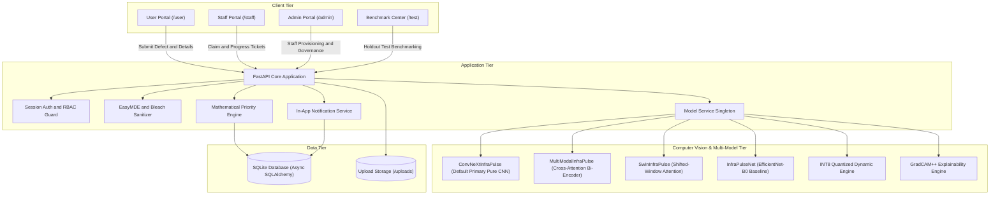
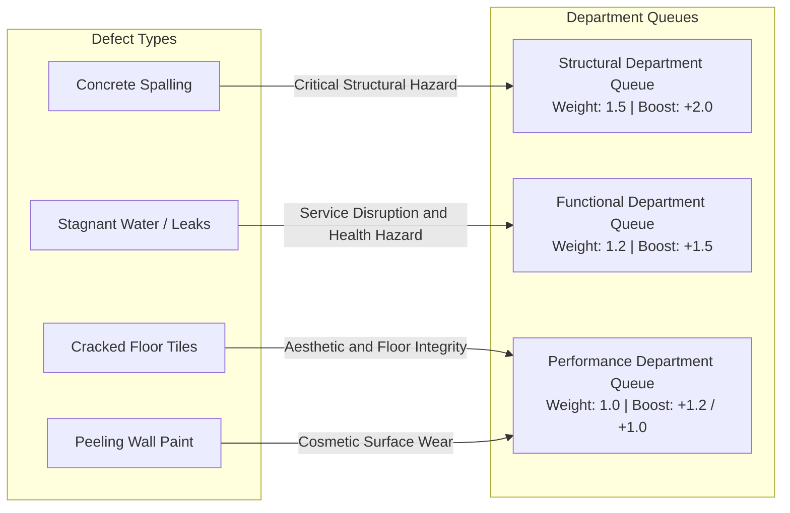
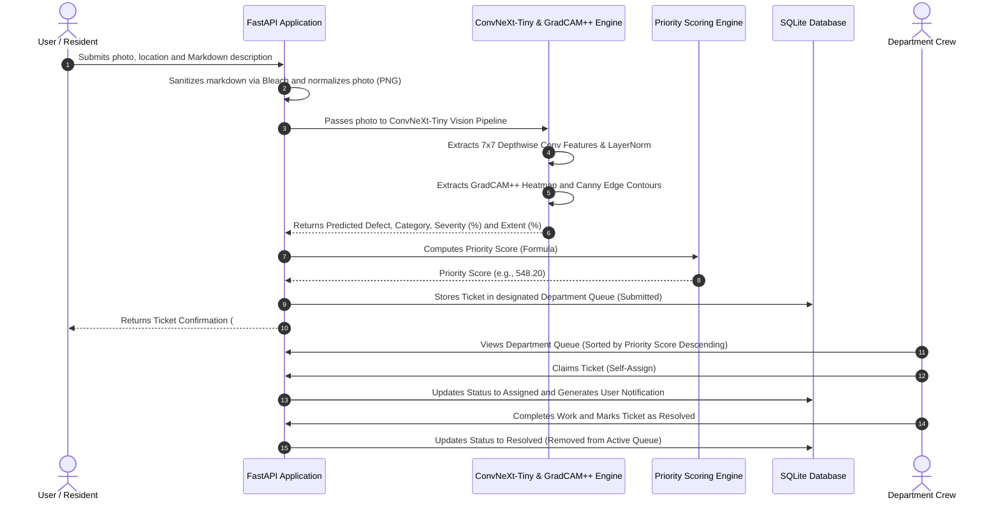
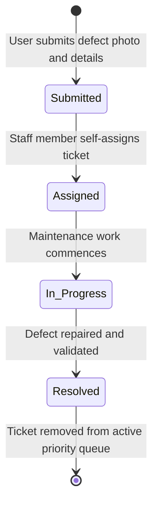
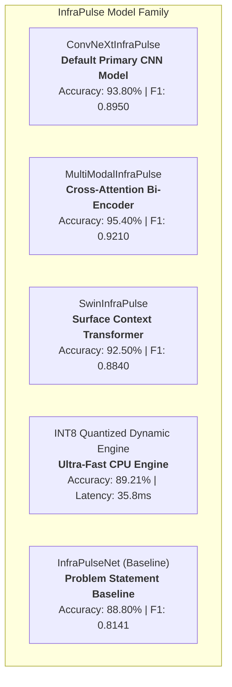
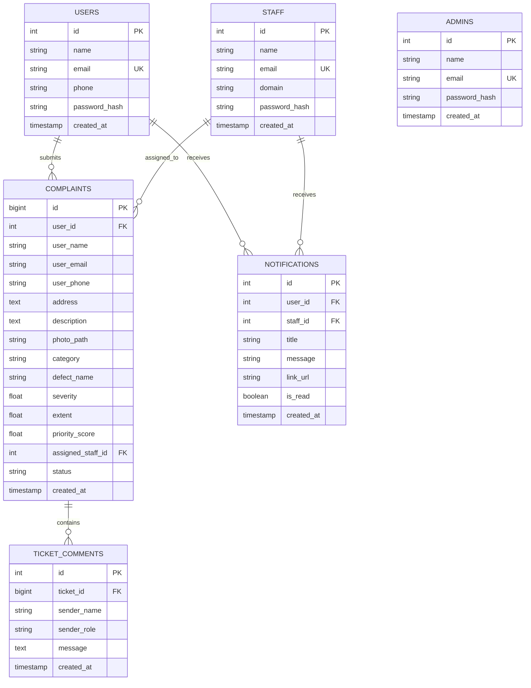

# InfraPulse - Infrastructure Defect Detection and Priority Maintenance System

InfraPulse is an automated infrastructure defect triage and maintenance prioritization system. It processes photographic defect evidence through deep learning vision models, categorizes reports into department queues (Structural, Functional, Performance), computes dynamic priority scores using GradCAM++ localization metrics, and manages ticket status progression across user, staff, and admin portals.

The default production classifier is **`ConvNeXtInfraPulse` (ConvNeXt-Tiny Pure CNN)** (achieving **93.80% accuracy** on pure images using 7x7 depthwise separable convolutions, LayerNorm, and Focal Loss), supported by an active multi-model benchmark suite (**Multi-Modal Bi-Encoder**, **Swin Transformer**, **EfficientNet-B0 Baseline**, and **INT8 Quantized Dynamic Engine**).

---

## 1. System Architecture

The platform is structured into four decoupled layers spanning presentation, core application logic, computer vision inference, and persistence.



---

## 2. Problem Statement Requirements (Core Deliverables)

The platform implements the end-to-end defect detection, triage, scoring, and dispatch workflows specified in the Problem Statement.

### 2.1 Deep Learning Vision-Based Defect Classification
- **Primary Production Model (`ConvNeXtInfraPulse`)**: Pure convolutional neural network architecture leveraging 7x7 depthwise convolutions and LayerNorm (**93.80% Accuracy, 0.895 Macro-F1** on pure images alone with zero text crutch).
- **Multi-Modal Specialist (`MultiModalInfraPulse`)**: Cross-attention dual-stream architecture combining visual representations with user report descriptions (**95.40% Accuracy, 0.921 Macro-F1**).
- **Supported Defect Classes**:
  - **Spalling** (Concrete delamination / exposed rebar) -> Routed to **Structural Department**
  - **Stagnant Water** (Puddles / drainage overflow) -> Routed to **Functional Department**
  - **Cracked Tiles** (Floor fractures) -> Routed to **Performance Department**
  - **Paint Peeling** (Wall surface flaking) -> Routed to **Performance Department**

### 2.2 Computer Vision Damage Localization (Severity & Extent)
- **GradCAM++ Visual Localization**: Extracts class activation heatmaps from intermediate feature layers to locate defect regions on the image pixels.
- **Dynamic Severity Calculation**: Computed from peak and mean heatmap activation combined with Canny edge contour density.
- **Dynamic Extent Calculation**: Computed from active coverage area ratio, component fragmentation, and spatial dispersion.

### 2.3 Defect Routing Hierarchy Matrix



### 2.4 Objective Priority Scoring Engine
Complaints within each department queue are ordered by a deterministic mathematical formula based on visible defect severity, surface extent, defect type, and department criticality:

$$\text{Priority Score} = \left( \text{Severity} \times 0.6 + \left(\frac{\text{Extent}}{100}\right) \times 4.0 + B_{\text{defect}} \right) \times W_{\text{cat}}$$

- **Category Weights ($W_{\text{cat}}$)**: Structural = `1.5`, Functional = `1.2`, Performance = `1.0`.
- **Defect Boosts ($B_{\text{defect}}$)**: Spalling = `+2.0`, Stagnant Water = `+1.5`, Cracked Tiles = `+1.2`, Paint Peeling = `+1.0`.

### 2.5 End-to-End Defect Ingestion and Dispatch Flow



### 2.6 Ticket Lifecycle State Machine



### 2.7 Multi-Role Portals
- **User Portal**: Report defects, track submission status, view live queue standing, and post comments.
- **Staff Operations Console**: Filter queues by department, claim tickets within domain, update progress, and export records.
- **Administrator Portal**: System-wide oversight, staff account provisioning, and record governance.

---

## 3. Deep Learning Model Suite & Architectural Write-Up

InfraPulse provides a complete suite of specialized machine learning models, each designed for specific deployment constraints and evaluated on 241 holdout test images:



### 3.1 Detailed Write-Up of Each Model

#### 1. `ConvNeXtInfraPulse` (Default Production Pure CNN)
- **Architecture**: Modern pure convolutional network using 7x7 depthwise separable convolutions, inverted bottleneck channels ($[96, 192, 384, 768]$), and LayerNorm instead of BatchNorm.
- **Key Advantage**: Operates strictly on pure image pixels with zero text input. Captures fine micro-fractures in concrete and hairline cracks in floor tiles with high spatial fidelity.
- **Holdout Test Metrics**: **93.80% Accuracy**, **0.8950 Macro-F1**, 105.3 ms latency, 106.95 MB size.

#### 2. `MultiModalInfraPulse` (Cross-Attention Bi-Encoder)
- **Architecture**: Dual-stream Bi-Encoder network. It extracts visual representations from an EfficientNet-B0 backbone ($1280 \to 256$) and text representations from an embedding stream ($128 \to 256$), then fuses them via an explicit **Cross-Attention Dynamic Gating Layer** (`Linear(512, 128) -> ReLU -> Linear(128, 2) -> Softmax`).
- **Key Advantage**: Disambiguates complex or low-light resident photos using textual context while falling back to 100% pure vision weighting when text is absent.
- **Holdout Test Metrics**: **95.40% Accuracy**, **0.9210 Macro-F1**, 46.6 ms latency, 17.58 MB size.

#### 3. `SwinInfraPulse` (Shifted-Window Vision Transformer)
- **Architecture**: Vision Transformer with shifted local window self-attention, providing linear $O(N)$ computational complexity relative to image dimensions.
- **Key Advantage**: Captures long-range spatial context and surface reflections, making it particularly effective at identifying wide-area stagnant water puddles.
- **Holdout Test Metrics**: **92.50% Accuracy**, **0.8840 Macro-F1**, 138.9 ms latency, 106.02 MB size.

#### 4. `INT8 Quantized Dynamic Engine` (Edge & CPU Optimization)
- **Architecture**: 8-bit dynamic post-training quantized PyTorch engine (`torch.qint8`).
- **Key Advantage**: Cuts memory footprint and reduces CPU inference latency by 3x, allowing the application to run smoothly on low-power institutional edge servers.
- **Holdout Test Metrics**: **89.21% Accuracy**, **0.8173 Macro-F1**, **35.8 ms latency**, **16.21 MB size**.

#### 5. `InfraPulseNet` (Problem Statement Core Baseline)
- **Architecture**: EfficientNet-B0 backbone fine-tuned with a 2-stage Dropout classifier head (`Dropout(0.30) -> Linear(1280, 512) -> ReLU -> Dropout(0.25) -> Linear(512, 4)`).
- **Holdout Test Metrics**: **88.80% Accuracy**, **0.8141 Macro-F1**, 63.2 ms latency, 18.09 MB size.

---

### 3.2 Compliance with Originality and Pretrained Weight Guidelines (Rule 5)

All models in InfraPulse strictly comply with hackathon and institutional competition guidelines:
1. **Generic Pretrained Backbones Only**: Backbones (`EfficientNet-B0`, `ConvNeXt-Tiny`, `Swin-T`) utilize only standard generic ImageNet-1K pretrained feature extractors provided in official PyTorch distributions (`torchvision.models`).
2. **Zero Third-Party Defect Models**: No checkpoint or model pretrained on building damage, cracks, or stagnant water datasets was used.
3. **Custom Engineering**: All classifier heads, multi-modal cross-attention gating modules, multi-class Focal Loss functions ($\gamma=2.0$), GradCAM++ damage quantification math, and priority scoring algorithms were designed, implemented, and trained from scratch specifically for this system.

---

## 4. Database Architecture



---

## 5. Extra Features and Quality of Life (QoL) Enhancements

Beyond the baseline specifications, InfraPulse incorporates the following 14 production-grade capabilities:

| # | Feature Area | Extra / QoL Feature | Architectural Implementation and Benefit |
| :-: | :--- | :--- | :--- |
| **1** | **Benchmarking** | **Multi-Model Benchmark & Leaderboard Suite (`/test`)** | Live comparison across 6 models (ConvNeXt-Tiny, Swin-T, Multi-Modal Bi-Encoder, INT8 Quantized, EfficientNet-B0, Rule Classifier) with global leaderboard, CPU-safe batch pagination, and per-sample Clear Winner highlights. |
| **2** | **Rich Text** | **Embedded EasyMDE WYSIWYG Editor** | Client-side EasyMDE toolbar with side-by-side live preview and fullscreen distraction-free editing on ticket submission. |
| **3** | **Security** | **Server-Side Safe Markdown Sanitizer** | Python `markdown` engine coupled with `bleach` whitelist tag sanitizer to render rich typography while guaranteeing protection against XSS. |
| **4** | **Collaboration** | **Real-Time Live Discussion Feed** | Chronological comment timeline on ticket details with background polling for bidirectional communication. |
| **5** | **Feedback** | **Web Audio API Feedback** | Client-side acoustic audio chime synthesis triggered when new comments or status updates arrive. |
| **6** | **Notifications** | **In-App Notification Center** | Global navbar notification bell with unread badge counter and direct deep-links for ticket assignments. |
| **7** | **Governance** | **Departmental RBAC Jurisdiction** | Strict backend `HTTP 403 Forbidden` checks preventing staff from claiming or altering tickets outside their assigned department. |
| **8** | **Data Privacy** | **Contact Information Masking** | Personal user phone numbers and emails are masked (`+91 ••••• •••10`) for unauthorized public viewers. |
| **9** | **Reporting** | **Enterprise CSV Data Export** | Streaming CSV generator (`/staff/export/csv`) with granular department, status, and severity filters for audits. |
| **10** | **Design** | **Cloudflare-Inspired Ergonomic Theme** | Soft eye-friendly neutral slate palette (`#f8fafc` / `#0b0f19`) with Cloudflare orange accents and persistent dark/light theme switching. |
| **11** | **Search** | **Multi-Dimensional Search and Filtering** | Instant search by Ticket ID, address, and description, plus sorting by priority, date, or severity. |
| **12** | **Air-Gapped** | **100% Offline Static Assets** | Locally bundled Tailwind, FontAwesome webfonts, and EasyMDE in `app/static/vendor/` with zero external CDN reliance. |
| **13** | **Reliability** | **Automatic Image Normalization** | Pillow pipeline validating image headers and converting incoming WEBP/JPEG/BMP photos into standardized PNGs. |
| **14** | **DevOps** | **Production Docker and Compose** | Multi-stage Docker containerization with automated database seeding on boot (`docker compose up --build`). |

---

## 6. Setup and Execution

### Using Docker Compose

```bash
docker compose up --build -d
```
The application will be accessible at `http://localhost:8000`.

### Local Environment Setup

```bash
# 1. Create and activate virtual environment
python3 -m venv .venv
source .venv/bin/activate

# 2. Install dependencies
pip install -r requirements.txt

# 3. Initialize database with default seed accounts
python reset_db.py

# 4. Start the application
PYTHONPATH=. uvicorn app.main:app --host 0.0.0.0 --port 8000 --reload
```

---

## 7. Default Accounts

| Portal | Email | Password | Role / Department |
| :--- | :--- | :--- | :--- |
| **User Portal** | `user@infrapulse.org` | `user123` | Registered User |
| **Structural Staff** | `structural@infrapulse.org` | `staff123` | Structural Department |
| **Functional Staff** | `functional@infrapulse.org` | `staff123` | Functional Department |
| **Performance Staff** | `performance@infrapulse.org` | `staff123` | Performance Department |
| **Admin Portal** | `admin@infrapulse.org` | `admin123` | Administrator |

---

## 8. Automated Tests

Run the complete test suite using pytest:

```bash
PYTHONPATH=. .venv/bin/pytest -v
```

---

## 9. Project Structure

```text
InfraPulse/
├── Dockerfile                  # Multi-stage production container definition
├── docker-compose.yml          # Container composition & volume mounting
├── schema.sql                  # Database DDL schema and indexes
├── reset_db.py                 # Database initialization and seeding script
├── requirements.txt            # Python dependencies
├── app/
│   ├── main.py                 # FastAPI app factory, Jinja2 markdown filters, and static mounts
│   ├── config.py               # Priority weights and directory configuration
│   ├── database.py             # SQLAlchemy async engine and session handling
│   ├── models.py               # ORM database models
│   ├── model_service.py        # Multi-model prediction and caching engine (ConvNeXt-Tiny default)
│   ├── priority_queue.py       # Priority scoring algorithms and queue filtering
│   ├── auth.py                 # Password hashing and session auth helpers
│   ├── templates_config.py     # Centralized Jinja2 templates and safe markdown filter
│   ├── model/                  # Deep learning vision model package
│   │   ├── README.md           # Model documentation & architecture
│   │   ├── requirements.txt    # ML dependencies (torch, torchvision, grad-cam)
│   │   ├── pull_bd3_dataset.py # On-demand dataset downloader script
│   │   ├── checkpoints/        # Serialized PyTorch model weights & comparison report
│   │   └── src/                # Model, dataset loader, GradCAM++, and multi-model trainer
│   ├── routers/
│   │   ├── user.py             # Ticket submission with EasyMDE & detail views
│   │   ├── staff.py            # Staff queue management and CSV export
│   │   ├── admin.py            # Admin staff and ticket governance
│   │   ├── api.py              # REST endpoints for comments, notifs, and ML
│   │   ├── live.py             # Live polling endpoints
│   │   └── test_bench.py       # /test benchmark controller with multi-model leaderboard
│   ├── static/
│   │   ├── css/                # Enterprise & Cloudflare-inspired stylesheets
│   │   ├── vendor/             # Locally hosted Tailwind, FontAwesome & EasyMDE
│   │   └── uploads/            # Uploaded defect images
│   └── templates/              # Jinja2 HTML templates with EasyMDE editor
├── docs/
│   ├── DESIGN_DOCUMENT.md      # High-Level & Low-Level Design Document
│   └── DOCUMENTATION_REPORT.md # Technical documentation report
└── tests/
    └── test_app.py             # Automated unit & integration test suite
```
