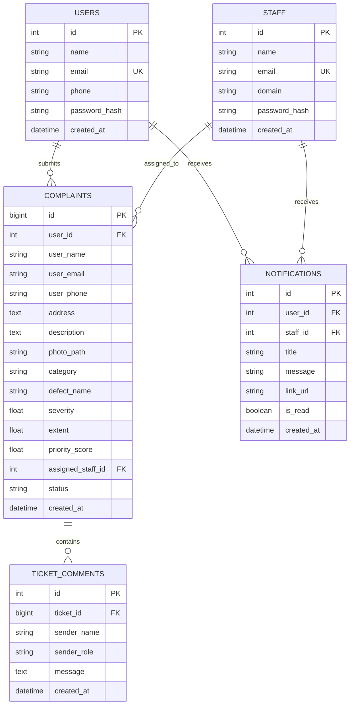

# System Design Document (HLD / LLD) - InfraPulse

**System Name**: InfraPulse - Defect Detection and Priority Maintenance System  
**Version**: 3.0.0  
**Stack**: Python 3.11+ (FastAPI), SQLite (Async SQLAlchemy / aiosqlite), PyTorch (EfficientNet-B0 + GradCAM++), Jinja2, Tailwind CSS, EasyMDE  

---

## 1. System Overview

### 1.1 Problem Context
Campus and institutional facilities receive hundreds of maintenance requests across diverse structural, plumbing, and aesthetic issues. Without automated intelligence and structured prioritization, critical safety hazards (e.g., concrete spalling or structural beam fractures) are delayed behind cosmetic complaints (e.g., paint peeling).

### 1.2 Core Problem Statement Objectives
- **Computer Vision Defect Classification**: Ingest defect photographs and classify them into 4 distinct physical defect types across 3 operational departments (**Structural**, **Functional**, **Performance**).
- **Physical Damage Quantification (Severity & Extent)**: Extract activation heatmaps using **GradCAM++** and Canny edge analysis to measure defect severity ($0-100\%$) and surface coverage extent ($0-100\%$) directly from pixels.
- **Objective Priority Engine**: Mathematically score and order queues to prevent manual triage bottlenecks using severity, surface extent, and category weighting.
- **Lifecycle Progression**: Enforce strict status transitions (`Submitted` $\to$ `Assigned` $\to$ `In Progress` $\to$ `Resolved`).
- **Domain Access Governance**: Prevent staff from modifying tickets outside their designated domain.

---

## 2. High-Level Design (HLD)

### 2.1 Architecture Overview

```mermaid
graph TB
    subgraph Client Tier
        UI_User["User Portal (/user)"]
        UI_Staff["Staff Portal (/staff)"]
        UI_Admin["Admin Portal (/admin)"]
        UI_Bench["Benchmark Center (/test)"]
    end

    subgraph Application Tier
        Auth["Authentication & RBAC Layer"]
        MDEngine["Markdown & Bleach Sanitizer"]
        UserRouter["User Router"]
        StaffRouter["Staff Router"]
        AdminRouter["Admin Router"]
        BenchRouter["Benchmark Router"]
        APIRouter["REST API Router"]
        PriorityEngine["Priority Scoring Engine"]
        ModelService["PyTorch Model Service"]
    end

    subgraph Computer Vision Layer (Problem Statement Core)
        Net["InfraPulseNet (EfficientNet-B0)"]
        GradCAM["GradCAM++ Heatmap Analyzer"]
        Checkpoint[("best_infrapulse_v1.pt")]
    end

    subgraph Data Tier
        DB[("SQLite Database")]
        Storage[("Uploads Storage (/uploads)")]
    end

    UI_User --> UserRouter
    UI_Staff --> StaffRouter
    UI_Admin --> AdminRouter
    UI_Bench --> BenchRouter

    UserRouter --> MDEngine
    UserRouter --> ModelService --> Net --> GradCAM
    Net --> Checkpoint
    UserRouter --> PriorityEngine --> DB
    StaffRouter --> DB
    AdminRouter --> DB
    APIRouter --> DB
    BenchRouter --> ModelService
```

---

## 3. Low-Level Design (LLD)

### 3.1 Data Schema



---

## 4. Priority Queue Mathematical Formulation

Complaints are dynamically ordered within department queues by computed priority scores:

$$\text{Priority Score} = \left( \text{Severity} \times 0.6 + \left(\frac{\text{Extent}}{100}\right) \times 4.0 + B_{\text{defect}} \right) \times W_{\text{cat}}$$

### Parameters
- **Severity** $\in [1.0, 10.0]$ (or $0-100\%$): Computed directly via GradCAM++ mean activation, peak activation, and edge density.
- **Extent** $\in [0\%, 100\%]$: Computed directly via GradCAM++ active area coverage ratio, component fragmentation, and spatial spread.
- **Category Weight ($W_{\text{cat}}$)**:
  - Structural: `1.5`
  - Functional: `1.2`
  - Performance: `1.0`
- **Defect Boost ($B_{\text{defect}}$)**:
  - Spalling: `+2.0`
  - Stagnant Water: `+1.5`
  - Cracked Tiles: `+1.2`
  - Paint Peeling: `+1.0`

---

## 5. Security & Access Control (RBAC)

| Role | Permissions |
| :--- | :--- |
| **Public / Guest** | Submit reports; view ticket detail with personal contact data masked. |
| **Registered User** | Submit reports with EasyMDE rich markdown formatting, view personal dashboard, post comments in live ticket feed. |
| **Staff Member** | View assigned department queue; claim and transition ticket statuses within domain; export queue to CSV. Cannot modify tickets outside assigned domain (`HTTP 403 Forbidden`). |
| **Administrator** | Provision and revoke staff accounts; manage cross-department ticket reports; remove records. |

---

## 6. Comprehensive Extra Features & Quality of Life (QoL) Architecture

### 6.1 Evaluation & Benchmarking
- **Live Dataset Benchmark Center (`/test`)**: Dedicated web GUI with batch pagination (10/page) and in-memory prediction caching comparing deep learning vs baseline heuristic classifiers on 1,500+ holdout images with zero CPU/RAM spikes.

### 6.2 Rich Text & Markdown Support
- **Embedded EasyMDE WYSIWYG Editor**: Client-side markdown suite with toolbar, side-by-side live preview, and full-screen modes on ticket submission.
- **Server-Side Safe Markdown Sanitizer**: Python `markdown` engine coupled with `bleach` whitelist tag sanitizer preventing XSS vectors.

### 6.3 Real-Time Interactivity & Alerts
- **Bidirectional Ticket Discussion**: Chronological comment feed with asynchronous background polling.
- **Web Audio API Feedback**: Acoustic audio pop chime synthesized when new comments or status updates arrive.
- **Global In-App Notification Center**: Real-time polling with dynamic unread badge counter and deep linking.

### 6.4 Governance, Data & Privacy
- **Cross-Domain Jurisdiction Protection**: Strict backend enforcement (`HTTP 403 Forbidden`) preventing cross-department ticket modifications.
- **Contact Privacy Redaction**: Automatic phone and email masking for unauthorized public viewers.
- **Enterprise CSV Export**: Streaming CSV downloads with granular department and severity filters.
- **100% Offline Static Assets**: Bundled vendor dependencies (Tailwind, FontAwesome, EasyMDE) for air-gapped intranet environments.
- **Automated Pillow Image Normalization**: Converts multi-format inputs (WEBP/JPG/BMP) to secure, standard PNGs.
- **Production Docker & Compose**: Multi-stage Docker deployment with automated database seeding on boot.
