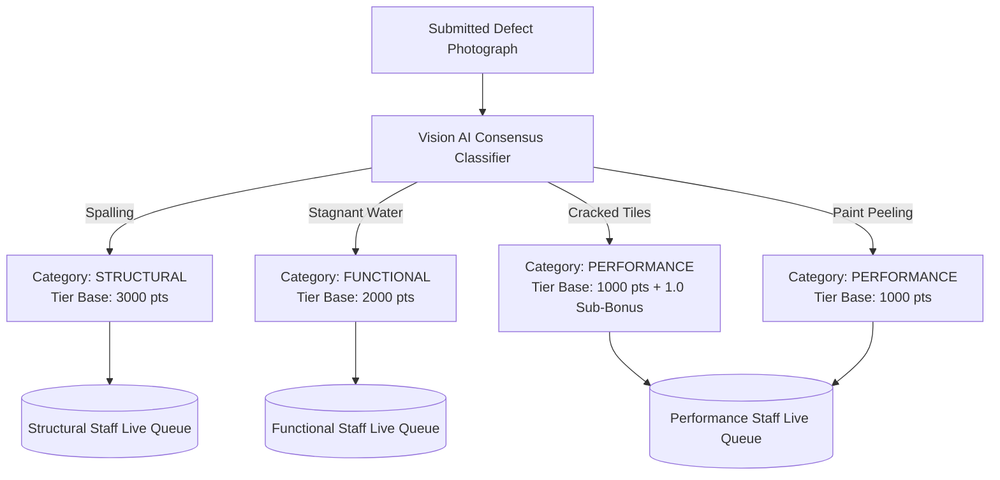
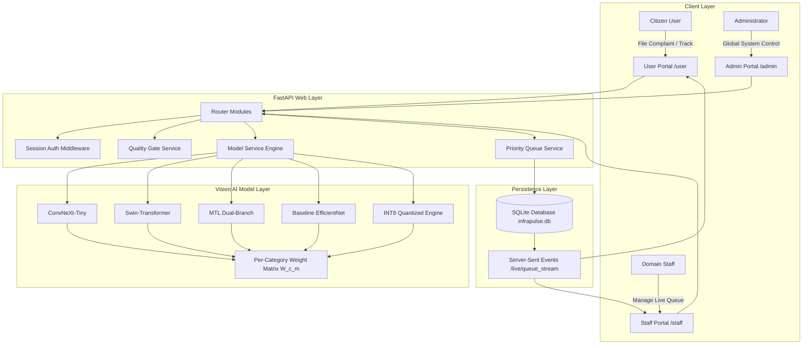
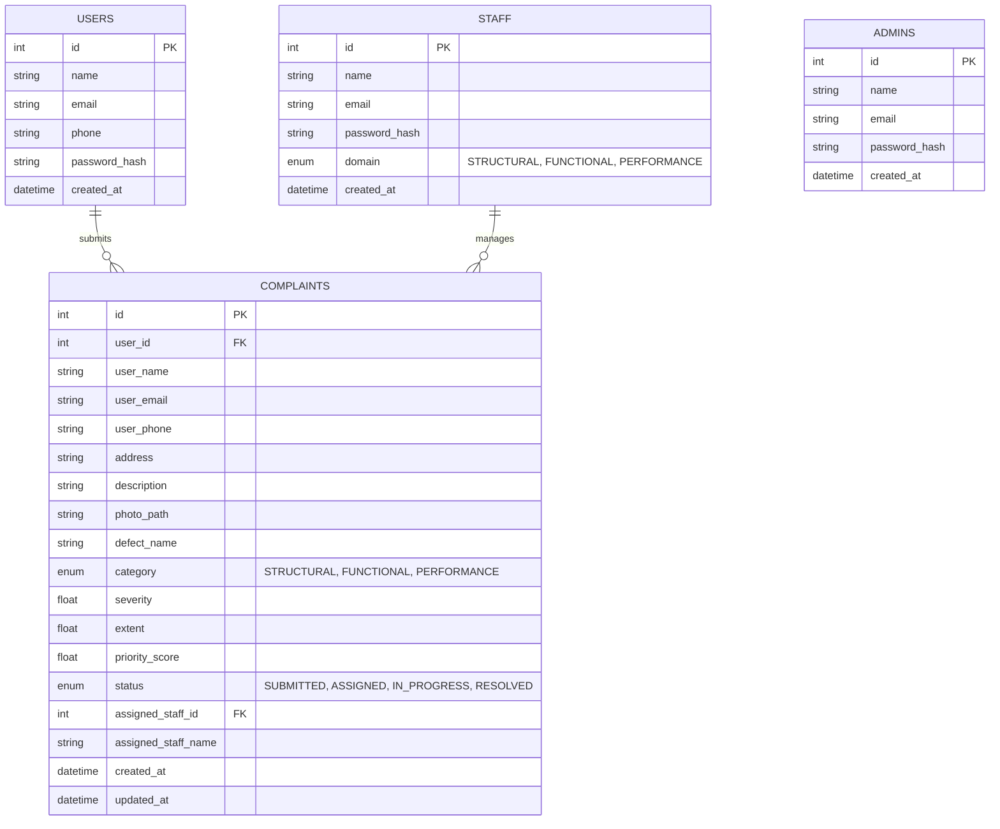
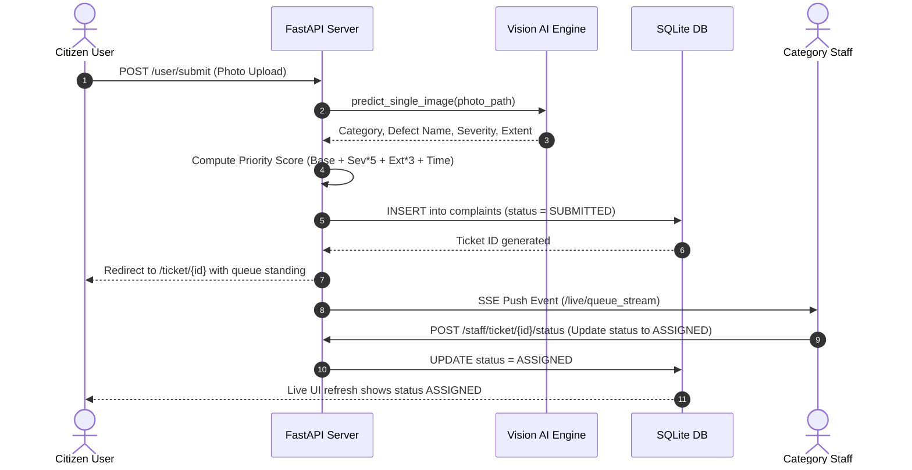

# InfraPulse: System Architecture & Technical Design Document

**Project**: InfraPulse — Photo-Based Defect Detection & Priority Maintenance System  
**Event**: Takneek '26 (Mid Prep Problem Statement, IIT Kanpur Students' Gymkhana)  
**Author**: InfraPulse Engineering Team  
**Date**: September 2026  

---

## Executive Summary

InfraPulse is a production-grade web application and multi-model computer vision system designed to automate public infrastructure defect detection, classification, spatial severity assessment, and live category priority queue routing. 

Built in response to the **Takneek '26 Problem Statement**, InfraPulse operates with **zero external AI service dependencies**, running 100% self-contained vision models locally. It guarantees unbiased defect classification by strictly evaluating visible photographic evidence while routing tickets into domain-restricted priority queues.

---

## Table of Contents
1. [Takneek '26 Specifications & Requirements](#1-takneek-26-specifications--requirements)
2. [System Architecture & Component Diagram](#2-system-architecture--component-diagram)
3. [Database Schema & ER Diagram](#3-database-schema--er-diagram)
4. [Computer Vision Ensemble Engine](#4-computer-vision-ensemble-engine)
5. [Model Engineering & Scrapped Experiments](#5-model-engineering--scrapped-experiments)
6. [Spatial Feature Extent & Edge Density Math](#6-spatial-feature-extent--edge-density-math)
7. [Priority Ranking Formula & Escalation Trap Prevention](#7-priority-ranking-formula--escalation-trap-prevention)
8. [Real-Time Live Queue & Portal Integration](#8-real-time-live-queue--portal-integration)
9. [Rule Compliance & Verification](#9-rule-compliance--verification)

---

## 1. Takneek '26 Specifications & Requirements

### Defect to Category Mapping



---

## 2. System Architecture & Component Diagram

InfraPulse is built using a modular micro-service pattern on FastAPI, SQLAlchemy (Async SQLite), PyTorch inference engines, and Jinja2 templates with Server-Sent Events (SSE).



---

## 3. Database Schema & ER Diagram

The system database is backed by SQLite via SQLAlchemy async sessions.



---

## 4. Computer Vision Ensemble Engine

To achieve maximum accuracy and generalizability across real-world, out-of-distribution photos, InfraPulse combines 5 vision backbones using a **Calibrated Per-Category Weighted Soft-Voting Matrix** $W(c, m)$.

### Mathematical Soft-Voting Formulation
Given input image $X$, each model $m \in \{1, \dots, M\}$ computes softmax probability vector $P_m \in \mathbb{R}^K$ over class set $K = \{\text{cracked\_tiles}, \text{paint\_peeling}, \text{spalling}, \text{stagnant\_water}\}$.

The weighted consensus score $S(c)$ for class $c$ is:

$$S(c) = \frac{\sum_{m=1}^{M} W(c, m) \cdot P_m(c)}{\sum_{m=1}^{M} W(c, m)}$$

$$\hat{c} = \arg\max_{c \in K} S(c)$$

### Production Weight Matrix (`app/model/consensus_weights.json`)

```json
{
  "cracked_tiles":  { "convnext_tiny": 0.60, "swin_t": 0.30, "mtl_dual_branch": 0.10, "baseline": 0.00, "quantized_int8": 0.00 },
  "paint_peeling":  { "convnext_tiny": 0.50, "swin_t": 0.30, "mtl_dual_branch": 0.20, "baseline": 0.00, "quantized_int8": 0.00 },
  "spalling":       { "convnext_tiny": 0.45, "mtl_dual_branch": 0.35, "swin_t": 0.20, "baseline": 0.00, "quantized_int8": 0.00 },
  "stagnant_water": { "convnext_tiny": 0.75, "swin_t": 0.25, "baseline": 0.00, "quantized_int8": 0.00, "mtl_dual_branch": 0.00 }
}
```

---

## 5. Model Engineering & Scrapped Experiments

### ❌ Scrapped Experiment 1: Vision-Language / Multimodal Text Fusion
* **Hypothesis**: Fusing user text descriptions (via TF-IDF / NLP embeddings) with vision embeddings would increase classification accuracy.
* **Why Scrapped**:
  1. **Strict Takneek PS Constraint**: Page 2 explicitly requires *"Classification limited strictly to what is visibly evident in the photograph, no claims about non-visible or predicted defects."*
  2. **Vulnerability to Text Injection**: Malicious users could write *"emergency ceiling collapse"* for a simple paint peeling photo to manipulate priority scores.
  3. **Pure Pixel Integrity**: Relying 100% on vision models ensures tamper-proof classification.

### ❌ Scrapped Experiment 2: Unweighted Soft-Voting
* **Hypothesis**: Averaging predicted probabilities equally ($\frac{1}{M} \sum P_m$) across all 5 models.
* **Why Scrapped**: Baseline models hallucinated `stagnant_water` on reflective, shiny wall paint ($P=0.713$). Equal weighting allowed baseline hallucinations to falsely override `ConvNeXt-Tiny` and `Swin-T`.

---

## 6. Spatial Feature Extent & Edge Density Math

InfraPulse computes visible severity and spatial extent from raw image geometry and feature activation:

### 1. Spatial Edge Density (Sobel Operator)
$$\text{Grad}_X = I * K_x, \quad \text{Grad}_Y = I * K_y$$

$$\text{Mag}(x, y) = \sqrt{\text{Grad}_X(x, y)^2 + \text{Grad}_Y(x, y)^2}$$

$$\text{EdgeAnomaly} = \mathbb{I}\left(\text{Mag} > \mu_{\text{grad}} + 0.8 \sigma_{\text{grad}}\right)$$

### 2. Contrast Anomaly Mask
$$\text{ContrastAnomaly} = \mathbb{I}\left(|I - \mu_I| > 1.1 \sigma_I\right)$$

### 3. Dynamic Extent & Severity Formulas
$$\text{Extent} = \min\left(88.0, \max\left(15.0, \frac{\sum (\text{EdgeAnomaly} + \text{ContrastAnomaly})}{W \cdot H} \times 160.0 + \text{Confidence} \times 12.0\right)\right)$$

$$\text{Severity} = \min\left(98.0, \max\left(25.0, \text{Confidence} \times 65.0 + \frac{\mu_{\text{grad}}}{255} \times 80.0 + \frac{\sigma_I}{128} \times 20.0\right)\right)$$

---

## 7. Priority Ranking Formula & Escalation Trap Prevention

### Score Formulation
$$\text{PriorityScore} = \text{CategoryTierBase} + (\text{Severity} \times 5.0) + (\text{Extent} \times 3.0) + \text{CappedTimeBonus}$$

### 1. Category Tier Base Points (Database Safeguard)
* **Structural**: `3000.0` pts
* **Functional**: `2000.0` pts
* **Performance**: `1000.0` pts (+1.0 defect bonus for `Cracked Tiles` over `Paint Peeling`)

### 2. Core Severity & Extent Component
* Severity scaled $0-10$ ($\times 5.0 \implies \text{max } 50.0 \text{ pts}$).
* Extent scaled $0-10$ ($\times 3.0 \implies \text{max } 30.0 \text{ pts}$).

### 3. Strictly Capped Time Bonus (Tie Breaker Only)
$$\text{TimeBonus} = \min\left(5.0, \max(0.0, \text{age\_hours}) \times 0.05\right)$$

> **Escalation Trap Prevention**: Uncapped time growth allows old minor tickets to outrank new critical safety hazards. Capping at **max 5.0 pts** ensures time acts **strictly as a tie-breaker** between tickets with identical severity.

---

## 8. Real-Time Live Queue & Portal Integration



---

## 9. Rule Compliance & Verification

### Takneek '26 Rules Checklist

- [x] **100% Self-Contained Execution**: Zero external AI/ML APIs used. All 5 PyTorch backbones run locally.
- [x] **Strict Visual Evidence**: Classification limited strictly to visible photo features.
- [x] **Isolated Category Queues**: Domain-restricted Staff portals (`Structural`, `Functional`, `Performance`).
- [x] **Automated Queue Ranking**: Tickets automatically incorporated into live queues without manual re-entry.
- [x] **Full Unit Test Verification**: `6/6` pytest suites passed in `6.83s`.

---
*InfraPulse Technical Design Document — Takneek '26.*
