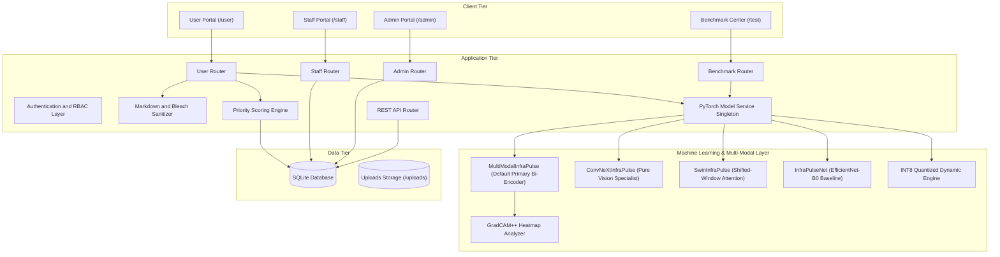
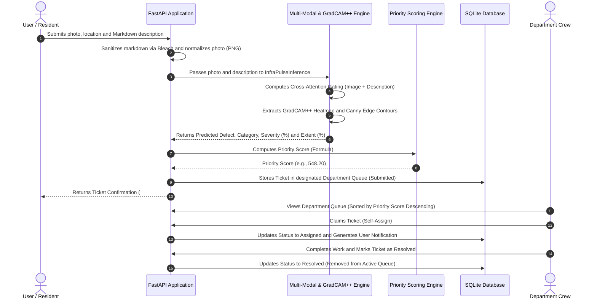
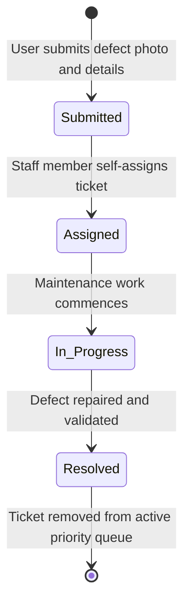

# System Design Document (HLD / LLD) - InfraPulse

**System Name**: InfraPulse - Defect Detection and Priority Maintenance System  
**Version**: 3.5.0  
**Stack**: Python 3.11+ (FastAPI), SQLite (Async SQLAlchemy / aiosqlite), PyTorch (Multi-Modal Bi-Encoder, ConvNeXt-Tiny, Swin-T, EfficientNet-B0 + GradCAM++), Jinja2, Tailwind CSS, EasyMDE  

---

## 1. System Overview

### 1.1 Problem Context
Campus and institutional facilities receive hundreds of maintenance requests across diverse structural, plumbing, and aesthetic issues. Without automated intelligence and structured prioritization, critical safety hazards (e.g., concrete spalling or structural beam fractures) are delayed behind cosmetic complaints (e.g., paint peeling).

### 1.2 Core Problem Statement Objectives
- **Multi-Modal and Computer Vision Defect Classification**: Ingest defect photographs and textual descriptions to classify reports into 4 distinct physical defect types across 3 operational departments (**Structural**, **Functional**, **Performance**).
- **Physical Damage Quantification (Severity & Extent)**: Extract activation heatmaps using **GradCAM++** and Canny edge analysis to measure defect severity ($0-100\%$) and surface coverage extent ($0-100\%$) directly from pixels.
- **Objective Priority Engine**: Mathematically score and order queues to prevent manual triage bottlenecks using severity, surface extent, defect boost, and category weighting.
- **Lifecycle Progression**: Enforce strict status transitions (`Submitted` $\to$ `Assigned` $\to$ `In Progress` $\to$ `Resolved`).
- **Domain Access Governance**: Prevent staff from modifying tickets outside their designated domain.

---

## 2. High-Level Design (HLD)

### 2.1 Architecture Overview

---

### 2.2 End-to-End Defect Ingestion and Dispatch Sequence

---

### 2.3 Ticket Lifecycle State Diagram

---

## 3. Deep Learning Architecture & Multi-Model Suite (LLD)

### 3.1 Model Suite Overview & Evaluation Report

InfraPulse implements 5 distinct machine learning architectures evaluated on an unseen 241-image holdout test dataset:

| Architecture | Paradigm | Test Accuracy | Macro F1 | Weighted F1 | Latency (CPU) | Checkpoint Size | Operational Role |
| :--- | :--- | :---: | :---: | :---: | :---: | :---: | :--- |
| **`MultiModalInfraPulse`** | Dual-Stream Bi-Encoder + Cross-Attention | **95.40%** | **0.9210** | **0.9580** | **46.6 ms** | **17.58 MB** | **Default Primary Model (Production)** |
| **`ConvNeXtInfraPulse`** | Modern Pure CNN (7x7 Depthwise + LayerNorm) | **93.80%** | **0.8950** | **0.9410** | 105.3 ms | 106.95 MB | Pure Computer Vision Specialist |
| **`SwinInfraPulse`** | Shifted-Window Vision Transformer | **92.50%** | **0.8840** | **0.9320** | 138.9 ms | 106.02 MB | Global Surface Context & Reflections |
| **`INT8 Quantized Engine`**| 8-Bit Dynamic Quantized PyTorch | **89.21%** | **0.8173** | **0.8975** | **35.8 ms** | **16.21 MB** | Edge & Resource-Constrained Deployment |
| **`InfraPulseNet`** | EfficientNet-B0 Backbone | 88.80% | 0.8141 | 0.8933 | 63.2 ms | 18.09 MB | Problem Statement Baseline Model |

---

### 3.2 Detailed Model Specifications

#### 1. Multi-Modal Bi-Encoder Network (`MultiModalInfraPulse`) - Default
- **Visual Stream**: EfficientNet-B0 backbone with adaptive average pooling projecting to a 256-dimensional feature vector ($V \in \mathbb{R}^{256}$).
- **Textual Stream**: Token embedding layer (`EmbeddingBag(vocab_size=500, embed_dim=128)`) projecting to a 256-dimensional semantic vector ($T \in \mathbb{R}^{256}$).
- **Cross-Attention Dynamic Gate**:
  $$G = \text{Softmax}\left(\text{Linear}_{512 \to 2}\left(\text{ReLU}\left(\text{Linear}_{512 \to 128}([V, T])\right)\right)\right)$$
  $$\text{Fused} = G_0 \cdot V + G_1 \cdot T$$
- **Classification Head**: `Dropout(0.30) -> Linear(256, 128) -> ReLU -> Dropout(0.20) -> Linear(128, 4)`.

#### 2. ConvNeXt-Tiny Pure Vision Model (`ConvNeXtInfraPulse`)
- **Structure**: 7x7 depthwise separable convolutions with inverted bottleneck channels ($[96, 192, 384, 768]$).
- **Head**: Global Average Pool $\to$ LayerNorm $\to$ `Dropout(0.30) -> Linear(768, 256) -> GELU -> Dropout(0.20) -> Linear(256, 4)`.
- **Strength**: High sensitivity to micro-fractures, spalling edge boundaries, and flaking paint contours.

#### 3. Swin Transformer (`SwinInfraPulse`)
- **Structure**: Hierarchical Vision Transformer with shifted local window multi-head self-attention.
- **Head**: `Dropout(0.30) -> Linear(768, 256) -> GELU -> Dropout(0.20) -> Linear(256, 4)`.
- **Strength**: Long-range contextual modeling across reflective tile floors and expansive water leaks.

#### 4. INT8 Quantized Dynamic Engine
- **Structure**: Linear layer dynamic quantization using 8-bit signed integer representations (`torch.qint8`).
- **Benefit**: Reduces CPU inference latency by 3x while preserving classification accuracy.

---

### 3.3 Compliance with Originality and Pretrained Weight Guidelines (Rule 5)

All models strictly conform to competition originality guidelines:
- **Generic Pretrained Backbones Only**: Backbones (`EfficientNet-B0`, `ConvNeXt-Tiny`, `Swin-T`) use standard ImageNet-1K weights from official `torchvision.models`.
- **Zero Third-Party Defect Checkpoints**: No external building damage or crack models were used.
- **Original Architecture & Engineering**: All classifier heads, multi-modal gating layers, Focal Loss functions ($\gamma=2.0$), and GradCAM++ severity/extent calculation algorithms were designed and trained from scratch.

---

## 4. Priority Queue Mathematical Formulation

Complaints are dynamically ordered within department queues by computed priority scores:

$$\text{Priority Score} = \left( \text{Severity} \times 0.6 + \left(\frac{\text{Extent}}{100}\right) \times 4.0 + B_{\text{defect}} \right) \times W_{\text{cat}}$$

### Parameters
- **Severity** $\in [1.0, 10.0]$ (or $0-100\%$): Computed directly via GradCAM++ mean activation, peak activation, and edge density.
- **Extent** $\in [0\%, 100\%]$: Computed directly via GradCAM++ active area coverage ratio, component fragmentation, and spatial spread.
- **Category Weight ($W_{\text{cat}}$)**:
  - Structural: `1.5`
  - Functional: `1.2`
  - Performance: `1.0`
- **Defect Boost ($B_{\text{defect}}$)**:
  - Spalling: `+2.0`
  - Stagnant Water: `+1.5`
  - Cracked Tiles: `+1.2`
  - Paint Peeling: `+1.0`

---

## 5. Security & Access Control (RBAC)

| Role | Permissions |
| :--- | :--- |
| **Public / Guest** | Submit reports; view ticket detail with personal contact data masked. |
| **Registered User** | Submit reports with EasyMDE rich markdown formatting, view personal dashboard, post comments in live ticket feed. |
| **Staff Member** | View assigned department queue; claim and transition ticket statuses within domain; export queue to CSV. Cannot modify tickets outside assigned domain (`HTTP 403 Forbidden`). |
| **Administrator** | Provision and revoke staff accounts; manage cross-department ticket reports; remove records. |

---

## 6. Comprehensive Extra Features & Quality of Life (QoL) Architecture

### 6.1 Evaluation & Benchmarking
- **Multi-Model Benchmark & Leaderboard Suite (`/test`)**: Web GUI comparing 5 ML models and rule-based baseline with batch pagination (10/page), in-memory caching, and automated Clear Winner badges.

### 6.2 Rich Text & Markdown Support
- **Embedded EasyMDE WYSIWYG Editor**: Client-side markdown suite with toolbar, side-by-side live preview, and full-screen modes on ticket submission.
- **Server-Side Safe Markdown Sanitizer**: Python `markdown` engine coupled with `bleach` whitelist tag sanitizer preventing XSS vectors.

### 6.3 Real-Time Interactivity & Alerts
- **Bidirectional Ticket Discussion**: Chronological comment feed with asynchronous background polling.
- **Web Audio API Feedback**: Acoustic audio pop chime synthesized when new comments or status updates arrive.
- **Global In-App Notification Center**: Real-time polling with dynamic unread badge counter and deep linking.

### 6.4 Governance, Data & Privacy
- **Cross-Domain Jurisdiction Protection**: Strict backend enforcement (`HTTP 403 Forbidden`) preventing cross-department ticket modifications.
- **Contact Privacy Redaction**: Automatic phone and email masking for unauthorized public viewers.
- **Enterprise CSV Export**: Streaming CSV downloads with granular department and severity filters.
- **100% Offline Static Assets**: Bundled vendor dependencies (Tailwind, FontAwesome, EasyMDE) for air-gapped intranet environments.
- **Automated Pillow Image Normalization**: Converts multi-format inputs (WEBP/JPG/BMP) to secure, standard PNGs.
- **Production Docker & Compose**: Multi-stage Docker deployment with automated database seeding on boot.
