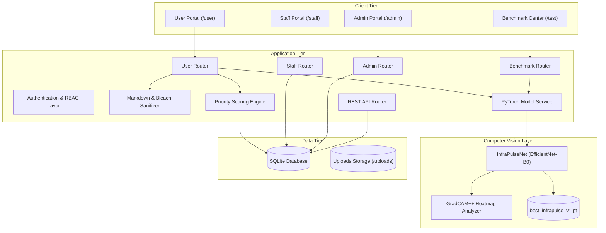
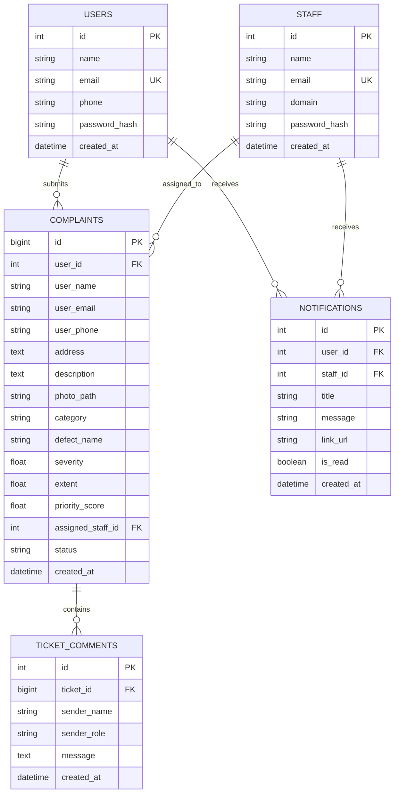

# System Design Document (HLD / LLD) - InfraPulse

**System Name**: InfraPulse - Defect Detection and Priority Maintenance System  
**Version**: 3.0.0  
**Stack**: Python 3.11+ (FastAPI), SQLite (Async SQLAlchemy / aiosqlite), PyTorch (EfficientNet-B0 + GradCAM++), Jinja2, Tailwind CSS  

---

## 1. System Overview

### 1.1 Problem Context
Campus and institutional facilities receive hundreds of maintenance requests across diverse structural, plumbing, and aesthetic issues. Without structured prioritization, critical safety hazards (e.g., concrete spalling or structural beam fractures) are delayed behind cosmetic complaints (e.g., paint peeling).

### 1.2 Core Problem Statement Objectives
- **Defect Ingestion & Classification**: Automate the intake of user photographs and route them into three designated operational departments: **Structural**, **Functional**, or **Performance**.
- **Objective Priority Engine**: Mathematically score and order tickets to prevent manual triage bottlenecks using severity, surface extent, and category weighting.
- **Lifecycle Progression**: Enforce strict status transitions (`Submitted` $\to$ `Assigned` $\to$ `In Progress` $\to$ `Resolved`).
- **Domain Access Governance**: Prevent staff from modifying tickets outside their designated domain.

---

## 2. High-Level Design (HLD)

### 2.1 Architecture Overview

---

## 3. Low-Level Design (LLD)

### 3.1 Data Schema

---

## 4. Priority Queue Mathematical Formulation

Complaints are dynamically ordered within department queues by computed priority scores:

$$\text{Priority Score} = \left( \text{Severity} \times 0.6 + \left(\frac{\text{Extent}}{100}\right) \times 4.0 + B_{\text{defect}} \right) \times W_{\text{cat}}$$

### Parameters
- **Severity** $\in [1.0, 10.0]$ (or $0-100\%$): Computed from GradCAM++ mean activation, peak activation, and edge density.
- **Extent** $\in [0\%, 100\%]$: Computed from GradCAM++ active area coverage ratio, component fragmentation, and spatial spread.
- **Category Weight ($W_{\text{cat}}$)**:
  - Structural: `1.5`
  - Functional: `1.2`
  - Performance: `1.0`
- **Defect Boost ($B_{\text{defect}}$)**:
  - Spalling: `+2.0`
  - Stagnant Water: `+1.5`
  - Cracked Tiles: `+1.2`
  - Paint Peeling: `+1.0`

---

## 5. Security & Access Control (RBAC)

| Role | Permissions |
| :--- | :--- |
| **Public / Guest** | Submit reports; view ticket detail with personal contact data masked. |
| **Registered User** | Submit reports with rich markdown formatting, view personal dashboard, post comments in live ticket feed. |
| **Staff Member** | View assigned department queue; claim and transition ticket statuses within domain; export queue to CSV. Cannot modify tickets outside assigned domain (`HTTP 403 Forbidden`). |
| **Administrator** | Provision and revoke staff accounts; manage cross-department ticket reports; remove records. |

---

## 6. Functional Capabilities & Extra Features

### 6.1 Problem Statement Core Deliverables
1. **Photographic Defect Ingestion**: Multi-format intake with automatic Pillow normalization to standard PNG.
2. **Tri-Department Routing**: Automated routing into Structural, Functional, and Performance queues.
3. **Objective Priority Engine**: Implementation of the mathematical queue ordering formula.
4. **Lifecycle State Management**: State machine supporting `Submitted`, `Assigned`, `In Progress`, and `Resolved`.

### 6.2 Extra Features & Quality of Life (QoL) Additions
1. **Deep Learning Vision Model (EfficientNet-B0 + GradCAM++)**:
   - Replaces mock classifiers with real neural network forward passes and GradCAM++ physical localization.
2. **Interactive Benchmark Center (`/test`)**:
   - Paginated holdout dataset evaluation page with side-by-side ML vs heuristic comparisons.
3. **WYSIWYG Markdown Editor & Bleach Sanitizer**:
   - Rich text formatting toolbar (Bold, Italic, Headers, Lists, Quotes, Tables) with live preview tab.
4. **Real-Time Ticket Discussion & Audio Feedback**:
   - In-app comment feed with live polling and acoustic pop sound indicator.
5. **In-App Notification Center**:
   - Navigation bar notification bell with unread badge counter for status changes.
6. **Domain Restriction Enforcement**:
   - Cross-category modification protection ensuring staff only operate on matching domain tickets.
7. **Contact Privacy Masking**:
   - Protection of personal phone numbers and emails against unauthorized viewers.
8. **Enterprise CSV Export**:
   - Endpoint for full dataset queue downloads.
9. **Cloudflare-Inspired Ergonomic UI**:
   - Eye-friendly neutral palette with amber-orange accents and full dark/light mode toggle.
10. **100% Offline Self-Contained Assets**:
    - Locally bundled Tailwind and FontAwesome webfonts.
11. **Production Dockerization**:
    - Multi-stage Docker container and Compose deployment.
