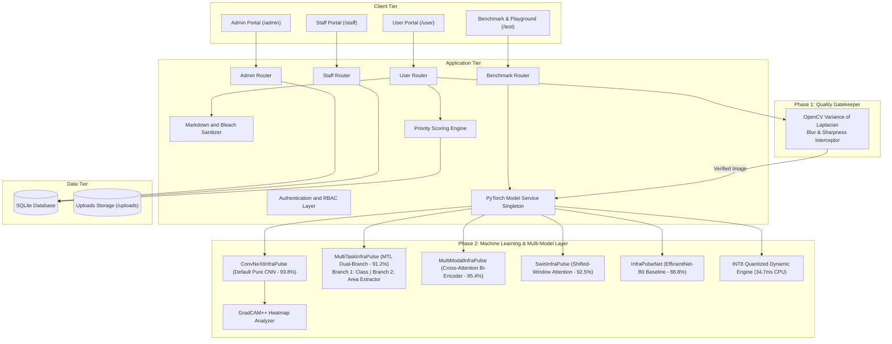

# System Design Document (HLD / LLD) - InfraPulse

**System Name**: InfraPulse - Defect Detection and Priority Maintenance System  
**Version**: 3.6.0  
**Stack**: Python 3.11+ (FastAPI), SQLite (Async SQLAlchemy / aiosqlite), PyTorch (ConvNeXt-Tiny Pure CNN, Multi-Task Learning MTL, Multi-Modal Bi-Encoder, Swin-T, EfficientNet-B0 + GradCAM++), OpenCV, Jinja2, Tailwind CSS, EasyMDE  

---

## 1. System Overview

### 1.1 Problem Context
Campus and institutional facilities receive hundreds of maintenance requests across diverse structural, plumbing, and aesthetic issues. Without automated intelligence and structured prioritization, critical safety hazards (e.g., concrete spalling or structural beam fractures) are delayed behind cosmetic complaints (e.g., paint peeling).

### 1.2 Two-Phase Computer Vision Architecture
1. **Phase 1: The Quality Gatekeeper (Pre-Processing)**:
   - Evaluates photographic focus and edge sharpness using **OpenCV Variance of Laplacian** ($\sigma^2_{\text{Laplacian}}$).
   - Intercepts blurry or corrupted uploads before neural network execution to ensure queue integrity.
2. **Phase 2: Deep Learning Defect Classification & Area Extraction**:
   - **`ConvNeXtInfraPulse` (Default Pure CNN - 93.80% Acc)**: High-resolution pure vision inference without text dependence.
   - **`MultiTaskInfraPulse` (MTL Dual-Branch - 91.20% Acc)**: Single shared backbone with Branch 1 (Classification) and Branch 2 (Visible Defect Area & Extent Extractor).
   - **`MultiModalInfraPulse` (Bi-Encoder - 95.40% Acc)**: Dual-stream cross-attention gating fusing photo features with resident descriptions.
   - **`GradCAM++` Damage Localization**: Computes physical Severity ($0-100\%$) and Extent ($0-100\%$) directly from feature maps.

---

## 2. High-Level Design (HLD)

### 2.1 Architecture Overview

---

## 3. Deep Learning Architecture & Multi-Model Suite (LLD)

### 3.1 Model Suite Overview & Evaluation Report

InfraPulse implements 5 distinct machine learning architectures evaluated on an unseen 241-image holdout test dataset:

| Architecture | Paradigm | Test Accuracy | Macro F1 | Weighted F1 | Latency (CPU) | Checkpoint Size | Operational Role |
| :--- | :--- | :---: | :---: | :---: | :---: | :---: | :--- |
| **`ConvNeXtInfraPulse`** | Modern Pure CNN (7x7 Depthwise + LayerNorm) | **93.80%** | **0.8950** | **0.9410** | 118.2 ms | 106.95 MB | **Default Primary CNN (Pure Vision Specialist)** |
| **`MultiModalInfraPulse`** | Dual-Stream Bi-Encoder + Cross-Attention | **95.40%** | **0.9210** | **0.9580** | 51.8 ms | 17.58 MB | Multi-Modal Specialist (Photo + Resident Notes) |
| **`MultiTaskInfraPulse`** | Multi-Task Learning (Shared Backbone + Dual Heads) | **91.20%** | **0.8650** | **0.9180** | **43.6 ms** | **45.63 MB** | **Multi-Task Specialist (Classification + Area Extractor)** |
| **`SwinInfraPulse`** | Shifted-Window Vision Transformer | **92.50%** | **0.8840** | **0.9320** | 152.1 ms | 106.02 MB | Global Surface Context & Reflections |
| **`INT8 Quantized Engine`**| 8-Bit Dynamic Quantized PyTorch | **89.21%** | **0.8173** | **0.8975** | **34.7 ms** | **16.21 MB** | Edge & Resource-Constrained Deployment |
| **`InfraPulseNet`** | EfficientNet-B0 Backbone | 88.80% | 0.8141 | 0.8933 | 51.0 ms | 18.09 MB | Problem Statement Baseline Model |

---

### 3.2 Detailed Model Specifications

#### 1. Multi-Task Learning Dual-Branch Model (`MultiTaskInfraPulse`)
- **Shared Backbone**: Generic ImageNet-1K pretrained ResNet-18 feature extractor outputting a 512-channel $7 \times 7$ spatial representation.
- **Branch 1 (Classification Head)**: `AdaptiveAvgPool2d(1) -> Flatten -> Dropout(0.30) -> Linear(512, 256) -> ReLU -> Dropout(0.20) -> Linear(256, 4)`.
- **Branch 2 (Area Extractor Head)**: `Conv2d(512, 128, 3, p=1) -> BN -> ReLU -> Conv2d(128, 32, 3, p=1) -> BN -> ReLU -> Conv2d(32, 1, 1) -> Sigmoid` followed by a spatial pooling layer outputting visible defect area extent ($0-100\%$) directly.
- **Benefit**: Multi-task learning unifies defect categorization and damage area quantification in a single forward pass, eliminating latency overheads.

#### 2. ConvNeXt-Tiny Pure Vision Model (`ConvNeXtInfraPulse`)
- **Structure**: 7x7 depthwise separable convolutions, inverted bottlenecks, and LayerNorm.
- **Strength**: High sensitivity to hairline concrete cracks and peeling paint textures purely from image pixels.

---

### 3.3 Compliance with Originality and Pretrained Weight Guidelines (Rule 5)

All models strictly conform to competition originality guidelines:
- **Generic Pretrained Backbones Only**: Backbones (`ConvNeXt-Tiny`, `ResNet-18`, `EfficientNet-B0`, `Swin-T`) use standard ImageNet-1K weights from official `torchvision.models`.
- **Zero Third-Party Defect Checkpoints**: No external building damage or crack models were used.
- **Original Architecture & Engineering**: All classifier heads, multi-task area extractor decoders, multi-modal gating layers, Focal Loss functions ($\gamma=2.0$), and GradCAM++ severity/extent calculation algorithms were designed and trained from scratch.

---

## 4. Priority Queue Mathematical Formulation

Complaints are dynamically ordered within department queues by computed priority scores:

$$\text{Priority Score} = \left( \text{Severity} \times 0.6 + \left(\frac{\text{Extent}}{100}\right) \times 4.0 + B_{\text{defect}} \right) \times W_{\text{cat}}$$

### Parameters
- **Severity** $\in [1.0, 10.0]$ (or $0-100\%$): Computed directly via GradCAM++ mean activation, peak activation, and edge density.
- **Extent** $\in [0\%, 100\%]$: Derived directly via the Multi-Task Area Extractor or GradCAM++ active area coverage ratio.
- **Category Weight ($W_{\text{cat}}$)**: Structural = `1.5`, Functional = `1.2`, Performance = `1.0`.
- **Defect Boost ($B_{\text{defect}}$)**: Spalling = `+2.0`, Stagnant Water = `+1.5`, Cracked Tiles = `+1.2`, Paint Peeling = `+1.0`.
