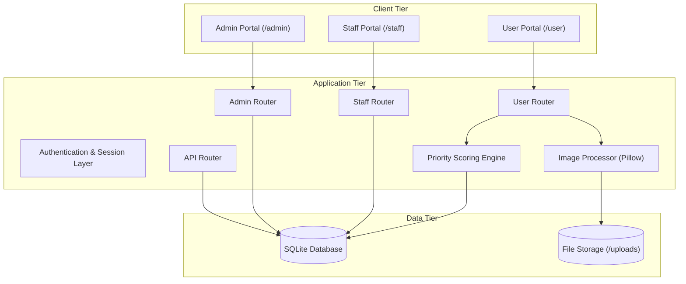
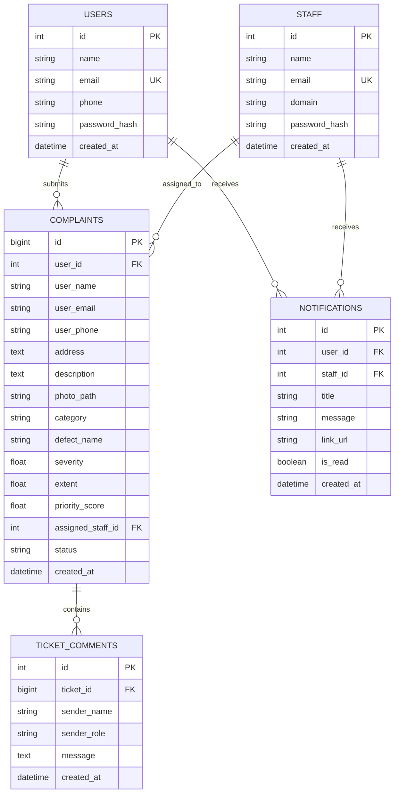

# System Design Document (HLD / LLD) - InfraPulse

**System Name**: InfraPulse - Defect Detection and Priority Maintenance System  
**Version**: 2.0  
**Stack**: Python (FastAPI), SQLite (Async SQLAlchemy), Jinja2, Tailwind CSS, DaisyUI  

---

## 1. System Overview

### 1.1 Problem Context
Campus and institutional facilities receive diverse maintenance requests daily. Without structured prioritization, urgent structural concerns (such as concrete spalling) can be treated with the same urgency as cosmetic defects (such as paint peeling), creating safety hazards and delayed resolutions.

### 1.2 Objectives
- Automate the routing of submitted defect reports to appropriate department queues: Structural, Functional, or Performance.
- Compute an objective priority score for each complaint based on visible severity, coverage extent, defect type, and domain criticality.
- Enforce predefined status transitions (`Submitted` $\to$ `Assigned` $\to$ `In Progress` $\to$ `Resolved`).
- Restrict staff actions to their assigned department domains.

---

## 2. High-Level Design (HLD)

### 2.1 Architecture Overview

---

## 3. Low-Level Design (LLD)

### 3.1 Data Schema

---

## 4. Priority Queue Mathematical Formulation

Complaints are ordered within department queues by computed priority scores:

$$\text{Priority Score} = \left( \text{Severity} \times 0.6 + \left(\frac{\text{Extent}}{100}\right) \times 4.0 + B_{\text{defect}} \right) \times W_{\text{cat}}$$

### Parameters
- **Severity** $\in [1.0, 10.0]$: Defect severity rating.
- **Extent** $\in [0\%, 100\%]$: Surface defect coverage area.
- **Category Weight ($W_{\text{cat}}$)**:
  - Structural: `1.5`
  - Functional: `1.2`
  - Performance: `1.0`
- **Defect Boost ($B_{\text{defect}}$)**:
  - Spalling: `+2.0`
  - Stagnant Water: `+1.5`
  - Cracked Tiles: `+1.2`
  - Paint Peeling: `+1.0`

---

## 5. Security and Access Control

| Role | Permissions |
| :--- | :--- |
| **Public / Guest** | Submit complaints; view complaints with contact information masked. |
| **Registered User** | Submit complaints, view personal ticket dashboard, participate in ticket comment timeline, and receive status notifications. |
| **Staff Member** | View assigned department queue; assign and update status for tickets within domain; export queue to CSV. Cannot modify tickets outside domain. |
| **Administrator** | Manage staff accounts; view cross-department ticket reports; remove records. |

---

## 6. Functional Capabilities

1. **In-Ticket Comments**: Provides a chronological messaging timeline on ticket detail pages with background polling.
2. **Notification Center**: Navigation dropdown that alerts users and staff to ticket assignment and status changes.
3. **Contact Data Privacy**: Masks personal contact information for visitors without authentication on ticket pages.
4. **Image Format Normalization**: Converts all incoming image uploads to PNG format via Pillow.
5. **CSV Export**: Allows staff and administrators to export queue data for reporting.
6. **Self-Hosted Assets**: Uses local copies of Tailwind, DaisyUI, and FontAwesome for reliable offline operation.
