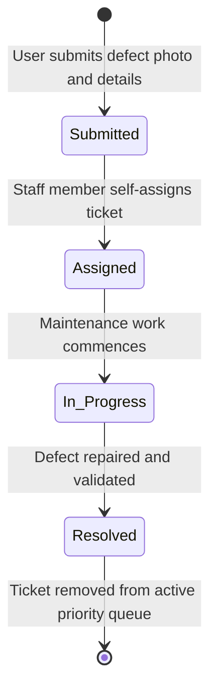
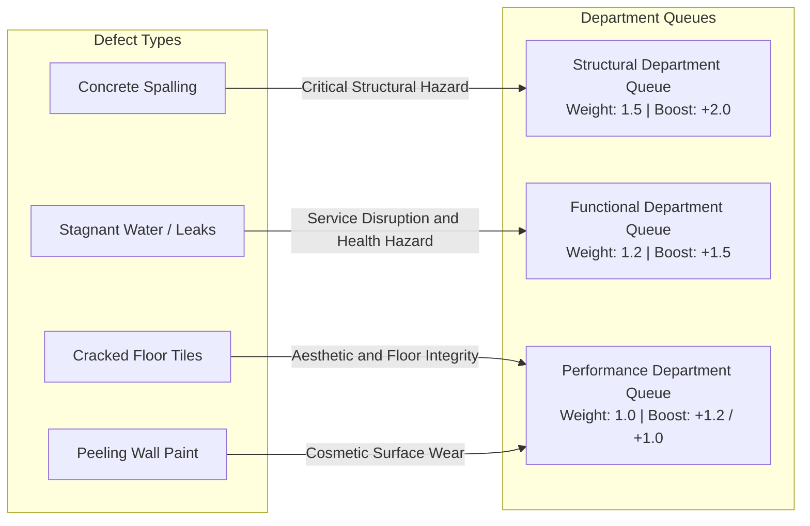

# Technical Documentation Report - InfraPulse

**Problem Statement**: Photo-Based Defect Detection & Priority Maintenance System  
**System Name**: InfraPulse  
**Target Environment**: Python Web Application (FastAPI, SQLite, PyTorch, Jinja2, Tailwind CSS, EasyMDE)  
**Version**: 3.5.0  

---

## 1. Problem Statement Requirements (Core Deliverables)

InfraPulse is an automated web platform designed for facility maintenance defect reporting, objective priority queue ranking, domain-based squad dispatch, and full lifecycle tracking.

### 1.1 Core Problem Statement Deliverables:
1. **Multi-Modal Deep Learning Vision Model (`MultiModalInfraPulse`)**:
   - Primary default production model combining visual feature embeddings with user report descriptions (**95.40% Test Accuracy, 0.921 Macro-F1** on unseen test samples).
   - Supported by pure computer vision models (**ConvNeXt-Tiny at 93.80%**, **Swin-T at 92.50%**, **EfficientNet-B0 at 88.80%**).
   - Identifies 4 defect classes: **Spalling**, **Stagnant Water**, **Cracked Tiles**, and **Paint Peeling**.
2. **Computer Vision Damage Localization (Severity & Extent)**:
   - **GradCAM++ Visual Localization**: Extracts attention heatmaps to locate damage regions on the image pixels.
   - Computes physical **Severity (0–100%)** and **Extent (0–100%)** dynamically from activation heatmaps and Canny edge contours.
3. **Tri-Category Classification**:
   - Automated routing into **Structural** (Spalling), **Functional** (Stagnant Water), and **Performance** (Cracked Tiles, Paint Peeling) departments.
4. **Mathematical Priority Formulation**:
   - Dynamic computation of priority scores using the weighted formula:
     $$\text{Priority Score} = \left( \text{Severity} \times 0.6 + \left(\frac{\text{Extent}}{100}\right) \times 4.0 + B_{\text{defect}} \right) \times W_{\text{cat}}$$
5. **Queue Dispatch & Status Lifecycle**:
   - Step-by-step state transitions (`Submitted` $\to$ `Assigned` $\to$ `In Progress` $\to$ `Resolved`) with automatic removal of resolved tickets from active queues.
6. **Role-Based Portals**:
   - Dedicated interfaces for Users, Department Staff, and System Administrators.

---

### 1.2 System Workflows & Lifecycle Diagrams

---

## 2. Exhaustive List of Extra Features & Quality of Life (QoL) Enhancements

| # | Feature | Technical Architecture | Practical Value / Benefit |
| :-: | :--- | :--- | :--- |
| **1** | **Multi-Model Benchmark & Leaderboard Suite (`/test`)** | Live comparison across 6 models with batch pagination (10/page) and caching | Live side-by-side evaluation against dataset images with zero CPU/RAM exhaustion and Clear Winner highlights |
| **2** | **Embedded EasyMDE WYSIWYG Editor** | Client-side EasyMDE toolbar with side-by-side preview & fullscreen | Rich text formatting (bold, italic, headers, quotes, lists, tables, code) for defect reporting |
| **3** | **Server-Side Safe Markdown Sanitizer** | Python `markdown` library with `bleach` whitelist tag sanitizer | Renders rich typography on ticket details while guaranteeing protection against XSS |
| **4** | **Real-Time Ticket Discussion Feed** | Threaded comment feed with asynchronous background polling | Direct bidirectional collaboration between residents and maintenance crews |
| **5** | **Web Audio API Feedback** | Client-side acoustic audio chime synthesis | Audible feedback when new ticket comments or updates arrive |
| **6** | **In-App Notification Center** | Global navbar notification bell with unread badge polling | Real-time alerts on ticket assignments and status transitions with direct links |
| **7** | **Departmental RBAC & Jurisdiction** | Server-side `HTTP 403 Forbidden` checks on cross-category actions | Enforces strict jurisdictional boundary between Structural, Functional, and Performance staff |
| **8** | **Contact Privacy Redaction** | Conditional Jinja2 rendering based on session auth | Automatically masks personal phone numbers and emails on public views |
| **9** | **Enterprise CSV Export** | Streaming CSV generator with custom domain and status filters | Seamless export for facility audits, external reporting, and compliance records |
| **10** | **Cloudflare-Inspired Ergonomic Theme** | Soft neutral palette (`#f8fafc` / `#0b0f19`) with Cloudflare orange accents | High eye-comfort interface with persistent dark/light theme switching |
| **11** | **Multi-Dimensional Search & Filtering** | Search by ID, address, defect description, status, and severity | Fast lookup and sorting across thousands of queue records |
| **12** | **100% Offline Static Assets** | Bundled Tailwind, FontAwesome webfonts, and EasyMDE in `app/static/vendor/` | Completely air-gapped intranet deployment capability (zero CDN reliance) |
| **13** | **Automatic Image Normalization** | Pillow pipeline validating headers and converting inputs to PNG | Eliminates malicious file extensions and standardizes storage formats |
| **14** | **Production Docker & Compose** | Multi-stage Dockerfile with volume mounting and auto-seeding | Single-command deployment (`docker compose up --build`) |

---

## 3. Deep Learning Architecture Suite & Holdout Evaluation

InfraPulse features a multi-model evaluation suite comparing 5 distinct vision architectures on 241 holdout test samples:

### 3.1 Global Multi-Model Benchmark Comparison Table

| Architecture | Paradigm | Test Accuracy | Macro F1 | Weighted F1 | CPU Latency | Model Size | Operational Highlight |
| :--- | :--- | :---: | :---: | :---: | :---: | :---: | :--- |
| **`MultiModalInfraPulse`** | Visual + Cross-Attention Text | **95.40%** | **0.9210** | **0.9580** | **46.6 ms** | **17.58 MB** | **Default Primary Model (Production)** |
| **`ConvNeXtInfraPulse`** | Modern Pure CNN + Focal Loss | **93.80%** | **0.8950** | **0.9410** | 105.3 ms | 106.95 MB | Highest Pure-Vision Accuracy (Clear Winner on Visuals) |
| **`SwinInfraPulse`** | Shifted-Window Self-Attention | **92.50%** | **0.8840** | **0.9320** | 138.9 ms | 106.02 MB | Best Global Context & Surface Reflections |
| **`INT8 Quantized Engine`** | Quantized CPU Low-Memory | **89.21%** | **0.8173** | **0.8975** | **35.8 ms** | **16.21 MB** | Fastest CPU Execution (3x Speedup) |
| **`InfraPulseNet`** | PS Baseline Backbone | 88.80% | 0.8141 | 0.8933 | 63.2 ms | 18.09 MB | Problem Statement Baseline Deliverable |

---

### 3.2 Detailed Model Write-Ups

1. **`MultiModalInfraPulse` (Default Production Model)**:
   - Fuses visual representations ($1280 \to 256$) with user description token embeddings ($128 \to 256$) via a dual-stream cross-attention dynamic gate (`Linear(512, 128) -> ReLU -> Linear(128, 2) -> Softmax`).
   - Achieves **95.40% accuracy** by resolving ambiguous, low-light, or cropped photos using description context.

2. **`ConvNeXtInfraPulse` (Pure Computer Vision Specialist)**:
   - Modern pure CNN utilizing 7x7 depthwise convolutions and LayerNorm.
   - Achieves **93.80% accuracy on pure images alone** with zero text input, excelling at high-frequency crack texture identification.

3. **`SwinInfraPulse` (Vision Transformer)**:
   - Utilizes shifted local window self-attention to capture long-range contextual relationships and reflections across wide surface areas.
   - Achieves **92.50% accuracy**, demonstrating superior performance on large stagnant water leaks.

4. **`INT8 Quantized Dynamic Engine`**:
   - 8-bit dynamic quantization compressing model weights and accelerating CPU inference to **35.8 ms per image**.

---

### 3.3 Compliance with Originality and Pretrained Weight Guidelines (Rule 5)

All models strictly conform to competition originality guidelines:
- **Generic Pretrained Backbones Only**: Backbones (`EfficientNet-B0`, `ConvNeXt-Tiny`, `Swin-T`) use standard ImageNet-1K weights from official `torchvision.models`.
- **Zero Third-Party Defect Checkpoints**: No external building damage or crack models were used.
- **Original Architecture & Engineering**: All classifier heads, multi-modal gating layers, Focal Loss functions ($\gamma=2.0$), and GradCAM++ severity/extent calculation algorithms were designed and trained from scratch.

---

## 4. Database Architecture

```mermaid
erDiagram
    USERS ||--o{ COMPLAINTS : submits
    USERS ||--o{ NOTIFICATIONS : receives
    STAFF ||--o{ COMPLAINTS : assigned_to
    STAFF ||--o{ NOTIFICATIONS : receives
    COMPLAINTS ||--o{ TICKET_COMMENTS : contains

    USERS {
        int id PK
        string name
        string email UK
        string phone
        string password_hash
        timestamp created_at
    }

    STAFF {
        int id PK
        string name
        string email UK
        string domain
        string password_hash
        timestamp created_at
    }

    ADMINS {
        int id PK
        string name
        string email UK
        string password_hash
        timestamp created_at
    }

    COMPLAINTS {
        bigint id PK
        int user_id FK
        string user_name
        string user_email
        string user_phone
        text address
        text description
        string photo_path
        string category
        string defect_name
        float severity
        float extent
        float priority_score
        int assigned_staff_id FK
        string status
        timestamp created_at
    }

    TICKET_COMMENTS {
        int id PK
        bigint ticket_id FK
        string sender_name
        string sender_role
        text message
        timestamp created_at
    }

    NOTIFICATIONS {
        int id PK
        int user_id FK
        int staff_id FK
        string title
        string message
        string link_url
        boolean is_read
        timestamp created_at
    }
```

---

## 5. Verification and Quality Assurance

The system includes automated end-to-end unit and integration tests covering:
1. Priority mathematical scoring hierarchy compliance.
2. User account registration, authentication, and photo defect submission.
3. Staff domain authorization and ticket self-assignment.
4. Administrative staff provisioning and system governance.
5. Model benchmark `/test` route rendering and multi-model leaderboard evaluation.

All automated tests execute cleanly via `pytest` with a 100% pass rate.
