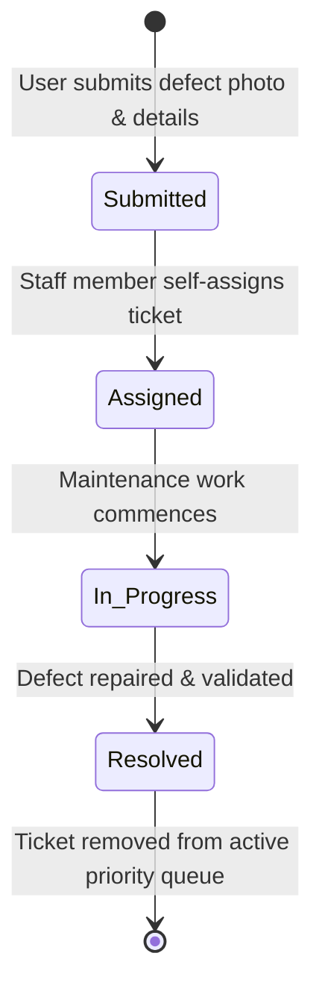
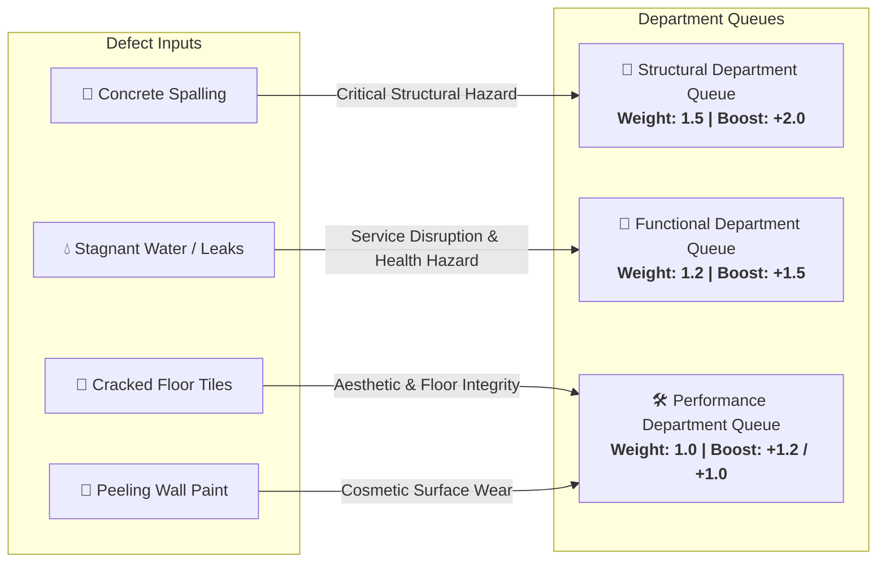
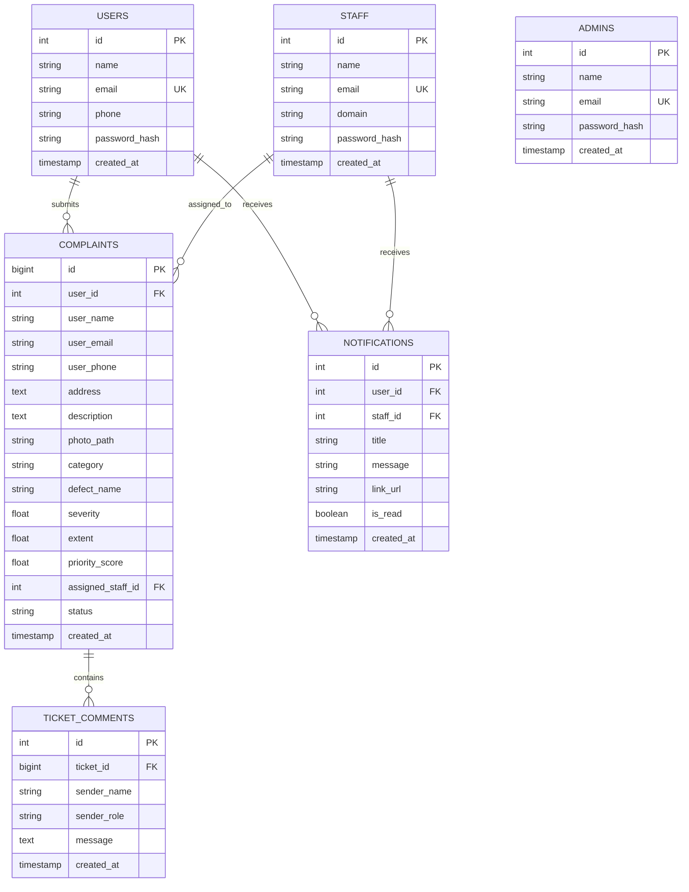

# Technical Documentation Report - InfraPulse

**Problem Statement**: Photo-Based Defect Detection & Priority Maintenance System  
**System Name**: InfraPulse  
**Target Environment**: Python Web Application (FastAPI, SQLite, PyTorch, Jinja2, Tailwind CSS, EasyMDE)  
**Version**: 3.0.0  

---

## 1. Problem Statement Requirements (Core Deliverables)

InfraPulse is an automated web platform designed for facility maintenance defect reporting, objective priority queue ranking, domain-based squad dispatch, and full lifecycle tracking.

### 1.1 Core Problem Statement Deliverables:
1. **Deep Learning Vision Model (`InfraPulseNet`)**:
   - PyTorch EfficientNet-B0 architecture fine-tuned on infrastructure defect datasets.
   - Evaluated on holdout test datasets achieving **88.8% accuracy** and **0.89 weighted F1-score**.
   - Identifies 4 defect classes: **Spalling**, **Stagnant Water**, **Cracked Tiles**, and **Paint Peeling**.
2. **Computer Vision Damage Localization (Severity & Extent)**:
   - **GradCAM++ Visual Localization**: Extracts attention heatmaps to locate damage regions on the image pixels.
   - Computes physical **Severity (0–100%)** and **Extent (0–100%)** dynamically from activation heatmaps and Canny edge contours.
3. **Tri-Category Classification**:
   - Automated routing into **Structural** (Spalling), **Functional** (Stagnant Water), and **Performance** (Cracked Tiles, Paint Peeling) departments.
4. **Mathematical Priority Formulation**:
   - Dynamic computation of priority scores using the weighted formula:
     $$\text{Priority Score} = \left( \text{Severity} \times 0.6 + \left(\frac{\text{Extent}}{100}\right) \times 4.0 + B_{\text{defect}} \right) \times W_{\text{cat}}$$
5. **Queue Dispatch & Status Lifecycle**:
   - Step-by-step state transitions (`Submitted` $\to$ `Assigned` $\to$ `In Progress` $\to$ `Resolved`) with automatic removal of resolved tickets from active queues.
6. **Role-Based Portals**:
   - Dedicated interfaces for Users, Department Staff, and System Administrators.

---

### 1.2 System Workflows & Lifecycle Diagrams





---

## 2. Exhaustive List of Extra Features & Quality of Life (QoL) Enhancements

| # | Feature | Technical Architecture | Practical Value / Benefit |
| :-: | :--- | :--- | :--- |
| **1** | **Interactive Benchmark Center (`/test`)** | Paginated holdout test route (10/page) with in-memory caching | Live side-by-side evaluation against dataset images with zero CPU/RAM exhaustion |
| **2** | **Embedded EasyMDE WYSIWYG Editor** | Client-side EasyMDE toolbar with side-by-side preview & fullscreen | Rich text formatting (bold, italic, headers, quotes, lists, tables, code) for defect reporting |
| **3** | **Server-Side Safe Markdown Sanitizer** | Python `markdown` library with `bleach` whitelist tag sanitizer | Renders rich typography on ticket details while guaranteeing protection against XSS |
| **4** | **Real-Time Ticket Discussion Feed** | Threaded comment feed with asynchronous background polling | Direct bidirectional collaboration between residents and maintenance crews |
| **5** | **Web Audio API Feedback** | Client-side acoustic audio chime synthesis | Audible feedback when new ticket comments or updates arrive |
| **6** | **In-App Notification Center** | Global navbar notification bell with unread badge polling | Real-time alerts on ticket assignments and status transitions with direct links |
| **7** | **Departmental RBAC & Jurisdiction** | Server-side `HTTP 403 Forbidden` checks on cross-category actions | Enforces strict jurisdictional boundary between Structural, Functional, and Performance staff |
| **8** | **Contact Privacy Redaction** | Conditional Jinja2 rendering based on session auth | Automatically masks personal phone numbers and emails on public views |
| **9** | **Enterprise CSV Export** | Streaming CSV generator with custom domain and status filters | Seamless export for facility audits, external reporting, and compliance records |
| **10** | **Cloudflare-Inspired Ergonomic Theme** | Soft neutral palette (`#f8fafc` / `#0b0f19`) with Cloudflare orange accents | High eye-comfort interface with persistent dark/light theme switching |
| **11** | **Multi-Dimensional Search & Filtering** | Search by ID, address, defect description, status, and severity | Fast lookup and sorting across thousands of queue records |
| **12** | **100% Offline Static Assets** | Bundled Tailwind, FontAwesome webfonts, and EasyMDE in `app/static/vendor/` | Completely air-gapped intranet deployment capability (zero CDN reliance) |
| **13** | **Automatic Image Normalization** | Pillow pipeline validating headers and converting inputs to PNG | Eliminates malicious file extensions and standardizes storage formats |
| **14** | **Production Docker & Compose** | Multi-stage Dockerfile with volume mounting and auto-seeding | Single-command deployment (`docker compose up --build`) |

---

## 3. Machine Learning & Model Performance

### Test Set Benchmark (241 Holdout Images):
- **Overall Accuracy**: **88.8%**
- **Weighted F1-Score**: **0.89**
- **Macro F1-Score**: **0.814**

#### Confusion Matrix:
```text
Actual \ Predicted     Cracked Tiles   Paint Peeling   Spalling   Stagnant Water
--------------------------------------------------------------------------------
Cracked Tiles (83)          76               0             4            3
Paint Peeling (78)           6              65             3            4
Spalling (75)                1               5            68            1
Stagnant Water (5)           0               0             0            5
```

---

## 4. Database Architecture



---

## 5. Verification and Quality Assurance

The system includes automated end-to-end unit and integration tests covering:
1. Priority mathematical scoring hierarchy compliance.
2. User account registration, authentication, and photo defect submission.
3. Staff domain authorization and ticket self-assignment.
4. Administrative staff provisioning and system governance.
5. Model benchmark `/test` route rendering and lazy-loaded evaluation.

All automated tests execute cleanly via `pytest` with a 100% pass rate.
