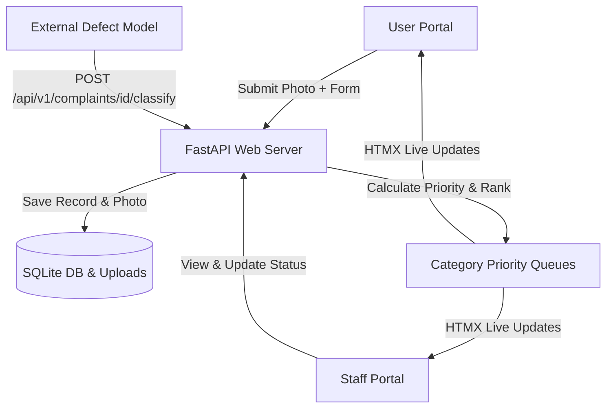

# Implementation Plan - InfraPulse Defect Detection & Priority Maintenance System

Build the complete, self-hosted web application for **InfraPulse** adhering to all specifications in `InfraPulse.pdf`. The system will feature separate user and staff portals, real-time priority queueing across defect categories (Structural, Functional, Performance), and flexible REST API endpoints for external ML model inference integration.

---

## Architecture & Technology Stack

- **Backend**: Python 3.10+ with **FastAPI**, **Uvicorn**, **SQLAlchemy** (Async SQLite database).
- **Frontend**: **Jinja2** HTML templates + **HTMX** (for live real-time queue updates) + **Tailwind CSS & DaisyUI** (via CDN for clean, responsive UI without Node.js dependencies).
- **Database**: SQLite (`infrapulse.db`) with async SQLAlchemy ORM models.
- **ML Integration**: REST API endpoints (`/api/v1/predict` / `/api/v1/complaints/{id}/classify`) for external model inference posting + built-in fallback detector for testing.



---

## Key Features & Requirements Mapping

1. **User Portal**:
   - Register complaint: Name, Address/Location, Description, Photo upload.
   - Live Tracking: View status (`Submitted` -> `Assigned` -> `In Progress` -> `Resolved`), detected defect name, category, and live position in queue.

2. **Staff Portal**:
   - Role/Domain Login: Structural, Functional, Performance queues.
   - Live priority queue sorted automatically by calculated defect priority score.
   - Status updates with automatic removal from live queue when marked `Resolved`.

3. **Defect Categories & Ranking Rules**:
   - **Structural**: e.g., `spalling` (Highest urgency category)
   - **Functional**: e.g., `stagnant water`
   - **Performance**: e.g., `cracked tiles`, `paint peeling` (Rule: `cracked tiles` > `paint peeling`)
   - Priority Score Formula: $Score = W_{cat} \times (Severity \times 0.6 + Extent \times 0.4)$ + defect rank adjustment.

4. **Model Integration Endpoint**:
   - `POST /api/v1/model/classify`: Accepts `complaint_id`, `defect_type`, `category`, `severity` (1-10), `extent` (percentage 0-100).
   - Re-calculates queue priorities dynamically upon payload receipt and pushes update to active web clients.

---

## User Review Required

> [!IMPORTANT]
> **Single Process Self-Hosted Deployment**:
> The entire stack runs as a single Python application using `uvicorn app.main:app`. Tailwind CSS and DaisyUI are loaded via CDN, eliminating any build tools (npm/node) requirements.

> [!NOTE]
> **Model Integration**:
> An endpoint `POST /api/v1/complaints/{complaint_id}/classify` will be provided for your ML model to POST detection results. A built-in mock classifier option will also be included for standalone manual testing.

---

## Proposed Changes

### Project Structure

```text
/home/bittu/Developer/projects/InfraPulse/
├── app/
│   ├── __init__.py
│   ├── main.py                  # FastAPI app entry point & route registration
│   ├── config.py                # App configuration & constants
│   ├── database.py              # SQLite connection & session manager
│   ├── models.py                # SQLAlchemy DB models (User, Complaint, Staff)
│   ├── schemas.py               # Pydantic schemas for request/response validation
│   ├── priority_queue.py        # Priority calculation & queue ordering engine
│   ├── routers/
│   │   ├── user.py              # User portal routes & complaint submission
│   │   ├── staff.py             # Staff portal routes & status management
│   │   ├── api.py               # REST API endpoints for ML model integration
│   │   └── live.py              # HTMX SSE/polling endpoints for live updates
│   ├── templates/
│   │   ├── base.html            # Base template with Tailwind/DaisyUI & HTMX
│   │   ├── user/
│   │   │   ├── login.html
│   │   │   ├── submit.html
│   │   │   └── dashboard.html
│   │   ├── staff/
│   │   │   ├── login.html
│   │   │   └── queue.html
│   │   └── components/
│   │       ├── complaint_card.html
│   │       └── queue_table.html
│   └── static/
│       ├── css/custom.css
│       └── uploads/             # Saved complaint photos
├── requirements.txt             # Python dependencies (fastapi, uvicorn, sqlalchemy, jinja2, etc.)
└── README.md                    # Setup & model integration docs
```

---

### Implementation Details

#### [NEW] `requirements.txt`
Dependencies:
```text
fastapi>=0.100.0
uvicorn[standard]>=0.22.0
sqlalchemy>=2.0.0
aiosqlite>=0.19.0
jinja2>=3.1.2
python-multipart>=0.0.6
pydantic>=2.0.0
```

#### [NEW] `app/models.py`
SQLAlchemy data structures for `User`, `Staff`, and `Complaint`.

```python
import enum
from datetime import datetime
from sqlalchemy import Column, Integer, String, Float, Enum, DateTime, ForeignKey, Text
from sqlalchemy.orm import declarative_base, relationship

Base = declarative_base()

class CategoryEnum(str, enum.Enum):
    STRUCTURAL = "Structural"
    FUNCTIONAL = "Functional"
    PERFORMANCE = "Performance"

class StatusEnum(str, enum.Enum):
    SUBMITTED = "Submitted"
    ASSIGNED = "Assigned"
    IN_PROGRESS = "In Progress"
    RESOLVED = "Resolved"

class Complaint(Base):
    __tablename__ = "complaints"

    id = Column(Integer, primary_key=True, index=True)
    user_name = Column(String(100), nullable=False)
    address = Column(String(255), nullable=False)
    description = Column(Text, nullable=False)
    photo_path = Column(String(255), nullable=False)
    
    # Model Detection Fields
    defect_name = Column(String(100), nullable=True, default="Pending Detection")
    category = Column(Enum(CategoryEnum), nullable=True)
    severity = Column(Float, default=1.0)  # Scale 1-10
    extent = Column(Float, default=1.0)    # Scale 0-100%
    priority_score = Column(Float, default=0.0)
    
    status = Column(Enum(StatusEnum), default=StatusEnum.SUBMITTED)
    created_at = Column(DateTime, default=datetime.utcnow)
    updated_at = Column(DateTime, default=datetime.utcnow, onupdate=datetime.utcnow)
```

#### [NEW] `app/priority_queue.py`
Priority calculation logic:
```python
CATEGORY_WEIGHTS = {
    "Structural": 3.0,
    "Functional": 2.0,
    "Performance": 1.0,
}

DEFECT_PRIORITY_BOOST = {
    "spalling": 10.0,
    "stagnant water": 5.0,
    "cracked tiles": 4.0,
    "paint peeling": 2.0,
}

def calculate_priority_score(category: str, defect_name: str, severity: float, extent: float) -> float:
    cat_weight = CATEGORY_WEIGHTS.get(category, 1.0)
    defect_boost = DEFECT_PRIORITY_BOOST.get(defect_name.lower(), 1.0)
    # Combined severity (60%) and extent (40%) multiplied by category and defect boost
    raw_score = (severity * 0.6) + (extent * 0.04)  # extent normalized to 0-4 range
    return round((raw_score + defect_boost) * cat_weight, 2)
```

#### [NEW] `app/routers/api.py`
REST Endpoint for Model Integration:
```python
from fastapi import APIRouter, Depends, HTTPException, status
from pydantic import BaseModel

router = APIRouter(prefix="/api/v1", tags=["Model Integration"])

class ClassificationPayload(BaseModel):
    complaint_id: int
    defect_name: str  # e.g., "spalling", "stagnant water", "cracked tiles", "paint peeling"
    category: str     # "Structural", "Functional", "Performance"
    severity: float   # 1.0 to 10.0
    extent: float     # 0.0 to 100.0

@router.post("/complaints/{complaint_id}/classify")
async def classify_complaint(complaint_id: int, payload: ClassificationPayload, db = Depends(get_db)):
    # Updates defect_name, category, priority_score and triggers queue update
    ...
```

---

## Verification Plan

### Automated Tests
1. **Database & API Tests**:
   - `pytest` suite testing complaint creation, REST model payload classification, and priority score computation.
   - Status transition test ensuring `RESOLVED` items are excluded from live active queue queries.

### Manual Verification
1. **User Flow**:
   - Open User Portal -> Fill name, address, description, upload image -> Submit.
   - Check complaint status page -> Verify "Pending Detection" -> Send POST request to `/api/v1/complaints/{id}/classify` with mock classification.
   - Observe live HTMX update showing identified defect, category, and queue rank.

2. **Staff Flow**:
   - Login to Staff Portal (e.g. Performance category).
   - Verify active complaints sorted strictly by priority score (`cracked tiles` before `paint peeling`).
   - Change status `Submitted` -> `Assigned` -> `In Progress` -> `Resolved`.
   - Confirm automatic removal of resolved item from staff live queue.
